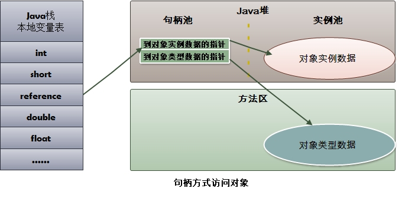
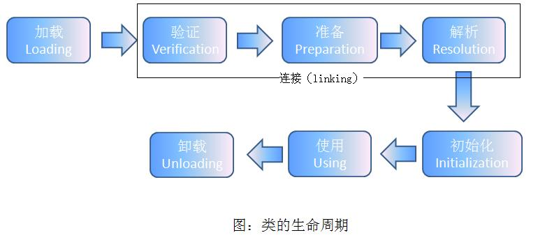

# 深入理解Java虚拟机 #


---

## Chapter 2, Java内存区域、内存溢出异常 ##

### 2.1 概述 ###

> Java与C++之间有一堵由**内存分配**和**垃圾收集**技术所围成的高墙，墙外的人想进来，墙里面的人想出来。

### 2.2 Java运行时数据区 ###


#### 2.2.1 程序计数器 ####

> **程序计数器（Program Counter Register）** 是一块儿较小的空间，用来指示当前线程所执行字节码的行号。
>    
> 字节码解释器工作时就是通过改变这个计数器的值来选定下一条需要执行的字节码指令，分支、循环、跳转、异常处理、线程恢复等基础功能都需要依赖这个计数器来完成。
>    
> *Java虚拟机的多线程是通过线程轮流切换并分配处理器执行时间的方式来实现的*。在任一时刻，一个处理器（对于多核处理器来说，就是一个内核）只会执行一条线程中的指令。因此，为了能够恢复线程切换之前的线程状态到正确位置，每条线程都需要有一个独立的程序计数器，各条线程之间互不影响，独立存储，我们称这类内存区域为**“线程私有”** 的内存。    
>
> 如果线程正在执行的是一个Java方法，这个计数器记录的是正在执行虚拟机字节码指令的地址；如果正在执行的是一个Native方法，这个计数器则是为空（Undefined）。    
> 此内存区域是唯一一个在Java虚拟机规范中没有规定任何OutOfMemoryError情况的区域。    

#### 2.2.2 虚拟机栈 ####

> **Java虚拟机栈（Java Virtual Machine Stack）** 也是线程私有的，它的生命周期与线程相同。它描述的是Java方法执行的内存模型：每个方法执行的时候都会同时创建一个栈帧（Stack Frame）用于存储局部变量、操作栈、动态链接、方法出口等信息。    
> *每一个方法被调用直至执行完成的过程，就对应着一个栈帧从虚拟机栈中从入栈到出栈的过程。*        
> 有人把Java内存区分为栈（Stack）和堆（Heap），这是比较粗糙的。实际上，这里的“栈”指的就是现在的这个虚拟机栈，或者确切点说，是虚拟机栈中的局部变量表部分。    
> 局部变量表中存放了编译期可知的基本数据类型（boolean、byte、char、short、int、float、long、double）、对象引用（refrence类型，可能是一个对象起始地址的应用指针、也可能是一个代表对象的句柄或者其它与此对象相关的地址）和returnAddress（指向了一条字节码指令的地址）。   
> 其中，64位长度的long和double类型的数据会占用2个局部变量空间（Slot），其余数据类型会占用一个。局部变量所占用的空间在编译期间完成分配，当进入一个方法时，这个方法在帧中所需要分配的局部变量的空间时完全可以确定的，在运行期间也不会改变这个空间的大小。    
> 如果线程请求的栈的深度大于虚拟机所能允许的深度，会触发StackOverflowError异常；如果虚拟机可以动态地扩展（当前大部分虚拟机都可以扩展，也可以指定固定长度），当扩展无法申请到足够的内存时，会抛出OutOfMemoryError异常。    

#### 2.2.3 本地方法栈 ####

> **本地方法栈（Native Method Stack）** 与虚拟机栈的作用非常相似，只不过虚拟机栈是为虚拟机执行字节码（Java方法）服务，而本地方法栈是用来服务于虚拟机使用的Native方法服务。    
> 具体的虚拟机可以自由实现它，甚至可以把它和虚拟机栈合二为一（譬如Sun HotSpot 虚拟机）。    
> 与虚拟机栈一样，本地方法栈也会抛出StackOverflowError和OutOfMemoryErroe异常。    

#### 2.2.4 Java堆 ####

> **Java堆（Java Heap）** 是Java虚拟机所管理的内存中最大的一块。是被所有的线程共享的一块内存区域，在虚拟机启动时创建。
>
> 此内存区域的唯一目的就是存放对象实例，几乎所有的对象实例都在此分配内存。由于JIT编译器的发展与逃逸分析技术的发展，栈上分配、标量替换优化技术的进步，所有的对象实例都分配在堆上也不是那么绝对了。
>    
> *Java堆是垃圾收集器管理的主要区域*，因此也被称为“GC堆”（Garbage Collection Heap）。现在的收集器都是采用分代收集算法，所以Java堆中可以细分为：新生代和老生代。
>
> 根据Java虚拟机规范，Java堆可以是处于物理上不连续的内存空间中，只要逻辑上连续即可。在实现上可以是固定大小，也可以是可扩展的，主流的是可扩展方式。

### 2.2.5 方法区 ###

> **方法区（Method Area）** 与Java堆一样，都是各个线程共享的内存区域，它用于存储已被虚拟机加载的类信息、常量、静态常量、即时编译器编译后的代码等数据。
>
> Java虚拟机规范对这个区域的限制非常松，除了和Java堆一样不需要连续的内存空间和可以选择固定大小或者可扩展外，还可以选择不实现垃圾收集。
>
> 当方法区的内存大小无法满足内存分配需要的时候，将抛出OutOfMemory异常。

### 2.2.6 运行时常量池 ###

> **运行时常量池（Runtime Constant Pool）** 是方法区的一部分。Class文件除了有类的版本、字段、方法、接口等描述信息，还有一项信息就是常量池，用于存放编译时期生成的各种字面量和符号引用，这部分内容将在类加载后存放到方法区的运行时常量池。
>
> 运行时常量池相对于Class文件常量池的另外一个重要特征是**具备动态性**，Java语言并不要求常量一定只能在编译期产生，也就是并非预置入Class文件中常量池的内容才能进入方法区运行时常量池，运行期间也可能将将新的常量放入池中，这种特性被开发人员利用的比较多的便是String类的intern()方法。
>
> 既然运行时常量池是方法区的一部分，自然会受到方法区内存的限制，当常量池无法再申请到内存时将会抛出OutOfMemoryError异常。

### 2.2.7 直接内存 ###

> **直接内存（Direct Memory）** 并不是虚拟机运行时数据区的一部分，也不是Java虚拟机规范中定义的内存区域，但是这部分内存也被频繁地使用，而且有可能导致OutOfMemoryError异常。
>
> 在JDK1.4种新加入了NIO（New Iuput/Output）类，引入了一种基于通道（Channel）与缓冲区（Buffer）的I/O方式，它可以使用Native函数直接分配堆外内存，然后通过一个存储在Java堆里面的DirectByteBuffer对象作为这快内存的引用进行操作。这样能在一些场景中显著提高性能，因为避免了在Java堆和Native堆中来回复制数据。
>
> 显然，本机直接内存非分配不会受到Java堆大小的限制，但是既然是内存，肯定会受到本机总内存的大小和处理器寻址空间的限制。所以也可能会抛出OutOfMemoryError异常。

### 2.3 对象访问 ###

> 对象访问在Java语言中无处不在，是最普通的程序行为，即使是最简单的访问，也涉及到Java栈、Java堆、方法区这三个重要的内存区域之间的关联关系，如下一句代码：  
>   
> 	```Object obj = new Object();```    
>
> 假设这句代码出现在方法体中，那"Object obj"这部分的语义将会反映到Java栈的本地变量中，作为一个Reference类型数据出现。    
>
> 而"new Object()"这部分的语义将会反映到Java堆中，形成一块儿存储了Object类型所有实例数据值（Instance Data，对象中各个实例字段的数据）的结构化内存，根据具体类型以及虚拟机实现的对象内存布局（Object Memory Layout）的不同，这块儿内存的大小是不固定的。
>    
> 另外，在Java堆中，还必须包含能包括能查到此对象类型数据（如，对象类型、父类、实现的接口、方法等）的地址信息，这些数据存储在方法区中。
>    
> 由于reference类型在Java虚拟机规范里只规定了一个指向对象的引用，并没有定义这个引用应该通过哪种方式去定位，以及访问到Java堆中的对象的具体位置，因此不同的虚拟机实现的对象访问方式会有所不同。
>
> 主流的访问方式有两种：使用句柄和直接指针。
>
- **句柄方式**，Java堆中将会划分出一块内存作为句柄池，reference中存储的就是对象的句柄地址，而句柄中包含了对象实例数据和类型数据各自的具体地址信息，如下图：


>
- **指针方式**，reference变量中直接存储的就是对象的地址，而Java堆对象的布局中就必须考虑如何防止访问类型数据的相关信息，如下图：

  

> 这两种对象的访问方式各有优势：    
>
- 使用句柄访问方式的最大好处是reference中存贮的是稳定的句柄地址，在对象被移动（比如垃圾收集时，对象移动是非常普遍的行为）时只会改变句柄中的实例数据指针，而reference本身不需要被修改。    
- 使用直接指针访问方式的最大好处就是速度更快，它节省了一次指针定位的时间开销，由于对象的访问在Java中非常频繁，因此这类开销积少成多也是一项非常可观的执行成本。
- *本书讨论的主要虚拟机Sun HotSpot，它是使用第二种方式进行对象访问的，但是从整个软件开发的范围来看，各种语言和框架使用句柄来访问的情况也十分常见。*

## 2.4 实战：OutOfMemoryError异常 ##
### 2.4.1 Java堆溢出 ###
> 可以通过限制Java堆的大小，设置为不可扩展（将堆的最小值参数-Xms和最大值参数-Xmx设置成一样即可避免堆自动扩展），通过参数-XX:+HeapDumpOnOutOfMemoryError可以让虚拟机在出现内存溢出异常时Dump出当前的内存堆转储快照以便以后进行分析。    
> Java堆内存的OOM异常是实际应用中最常见的内存溢出异常情况。出现Java堆内存溢出时，异常堆栈信息“java.lang.OutOfMemoryError”会跟着进一步提示“Java heap space”。如下图所示：    
>     
> 要解决这个区域的异常，一般的手段是首先通过内存映像分析工具（如Eclipse Memory Analyzer）对dump出的堆转储快照进行分析，重点是确认内存中的对象是否是必要的，也就是要先分清楚到底是出现了内存泄漏（Memory Leak）还是内存溢出（Memory Overflow）。如下图展示了使用Eclipse Memory Analyzer Tools打开的堆转储快照文件：    
>     
> 如果是内存泄漏，可进一步通过工具查看泄漏对象到GC Roots的引用链。于是就能找到泄漏对象是通过怎样的路径与GC Roots相关联并导致垃圾收集器无法自动回收它们的。掌握了泄漏对象的类型信息，以及GC Roots引用链的信息，就可以比较准确地定位出泄漏代码的位置。    
> 如果不存在泄漏，换句话说就是内存中的对象确实都还必须存活着，那就应当检查虚拟机的堆参数（Xmx和Xms），与机器物理内存对比看是否还可以调大，从代码上检查是否存在某些对象生命周期过长、持有状态时间过长的情况，尝试减少程序运行期间的内存消耗。

### 2.4.2 虚拟机栈和本地方法栈溢出 ###
> 由于在HotSpot虚拟机中并不区分虚拟机栈和本地方法栈，因此对于HotSpot来说，-Xoss参数（设置本地方法栈大小）虽然存在，但实际上是无效的，栈容量只由-Xss参数设定。    
> 关于虚拟机栈和本地方法栈，在Java虚拟机规范中描述了两种异常：    
>
- 如果线程请求的栈深度大于虚拟机所允许的最大深度，将抛出StackOverflowError异常。
>
- 如果虚拟机在扩展栈时无法申请到足够的内存空间，则抛出OutOfMemoryError异常。    

> 这里把异常分为两种情况，实际上却存在着一些互相重叠的地方：当栈空间无法分配时，到底是内存太小，还是已使用的栈空间太大，其本质只是对同一事件的两种表述而已。

### 2.4.3 运行时常量池溢出 ###
> 如果要向运行时常量池中添加内容，最简单的方法是使用String.intern()这个Native方法。该方法的作用时：如果池中包含了一个等于此String对象的字符串，则返回代表池中这个字符串的String对象；否则，将此String对象包含的字符串添加到常量池中，并且返回此String对象的引用。由于常量池分配在方法区内，我们可以通过-XX:PermSize和-XX:MaxPermSize限制方法区的大小，从而间接限制其中常量池的容量。

### 2.4.4 方法区溢出 ###
> 方法区用于存放Class相关的信息，如类名、访问修饰符、常量池、字段描述、方法描述等。生成大量的动态类区填充方法区，可以触发此区域的溢出异常。
> 方法区溢出是一种常见的内存溢出异常，一个类如果要被垃圾收集器回收，判定的条件比较苛刻。在经常动态生成大量Class的应用中，需要特别注意类的回收状况。这类场景出了CGLib字节码增强外，还有大量JSP或者基于OSGi的应用等。

### 2.4.5 本机直接内存溢出 ###
> DirectMemory可以通过-XX:MaxDirectMemorySize指定，如果不指定，则默认与Java堆的最大值（-Xmx指定）一样。


## Chapter 3, 垃圾收集器与内存分配策略 ##

### 3.1 概述 ###

> 垃圾收集（Garbage Collection , GC）的历史远远比Java久远。它需要完成三件事：
>  
- 哪些内存需要回收
- 什么时候回收
- 如何回收    

> 程序计数器、虚拟机栈、本地方法栈三个区域随线程而生，随线程而灭；栈中的栈帧随着方法的进入和退出而有条不紊地执行着出栈和入栈操作，每一个栈帧需要分配多少内存基本上是在类结构确定下来时就已知的（尽管在运行期会由JIT编译器进行一些优化，但是大体上可以认为是编译器可知的），因此在这几个区域的内存分配和回收都具有确定性，这几个区域不太需要过多地考虑回收的问题。而Java堆和方法区则不一样，一个接口中的多个实现类需要的内存可能不一样，一个方法中的多个分支需要的内存也可能不一样，我们只有在程序处于运行期间才能知道会创建哪些对象，这部分的内存分配和回收都是动态的，垃圾收集器需要关注的是这部分内存，我们所讨论的“内存”分配与回收也仅仅指着一部分。

### 3.2 对象已死？ ###
> 堆中存放着Java世界中几乎所有的对象，垃圾收集器在对堆进行回收前，第一件事就是要确定哪些对象还“存活着”，哪些已经“死去”（即不可能再被任何途径使用的对象）。

#### 3.2.1 引用计数算法 ####
> **引用计数算法（Reference Counting）**：给对象添加一个引用计数器，每当有一个地方引用它时，计数器的数值就加1；当引用失效时，计数器数值就减1；任何时刻计数器都为0的对象就是不可能再被使用的。    
> 实际上，Java并没有采用引用计数算法，因为它很难解决对象之间的相互循环引用的问题。    

#### 3.2.2 根搜索算法 ####
> 在主流的商业程序语言中（Java和C#），都是使用**根搜索算法（GC Roots Tracing）**来判定对象是否存活的。    
> 这个算法的基本思路是：通过一系列的名字为“GC Roots”的对象作为起点，从这些节点开始向下搜索，搜索所走过的路径称为**引用链（Reference Chain）**，当一个对象到GC Roots没有任何引用链对象相连（用图论的话说，就是从GC Roots到这个对象不可到达）时，则证明此对象不可用。    
> 如下图示：    


    

>     
> - 对象object5、object6和object7虽然互相关联，但是他们到GC Roots是不可到达的，所以它们会被判定为师可回收对象。
> 在Java中，可以作为GC Roots的对象有以下几种：    
>
> - 虚拟机栈（栈中的本地变量表）中的引用的对象
> - 方法区中的类静态属性引用的对象
> - 方法区中的常量引用的对象
> - 本地方法栈中JNI（即一般说的Native方法）的引用的对象

#### 3.2.3 再谈引用 ####
> 在JDK1.2之前，Java中的引用（Reference）非常狭隘：
>
> **如果Reference类型的数据中存储的数值代表着另一块内存的起始地址，就称这块内存代表着一个引用。**  
>   
> 在JDK1.2之后，Java对引用的概念进行了扩充，将引用分为强引用（Strong Reference）、软引用（Soft Reference）、弱引用（Weak Reference）和虚引用（Phantom Reference）。这四种引用强度依次减弱。
>
> - **强引用**，就是在程序代码中普遍存在的，类似```Object obj  = new Object()```这类的引用，只要强引用还存在，垃圾回收器永远不会回收掉被引用的对象。
> - **软引用**，用来描述一些还有用，但是并非必需的对象。对于软引用关联的对象，在系统将要发生内存溢出异常之前，将会把这些对象放进回收范围之中并进行第二次的回收。如果这次回收还是没有足够的内存，才会抛出内存溢出异常。在JDK1.2之后，提供了SoftReference类来实现软引用。
> - **弱引用**，也是用来描述非必需对象的，但是它的强度要比软引用弱一些，被弱引用关联的对象只能生存到下一次垃圾回收之前。当垃圾回收器工作时，不论当前内存是否足够，都会回收掉只被弱引用关联的对象。在JDK1.2之后，提供了WeakReference来实现弱引用。
> - **虚引用**，也称为幽灵引用或者幻影引用，它是最弱的一种引用关系。一个对象是否有虚引用的存在，完全不影响其生存时间，也无法通过虚引用来获取一个对象的实例。为一个对象设置虚引用的唯一目的就是希望这个对象被收集器回收时收到一个系统通知。在JDK1.2之后，提供了PhantomReference类来实现虚引用。

#### 3.2.4 生存还是死亡？ ####
> 在根搜索算法不可达的对象，也并非是“非死不可”的，它们暂时处于“死缓”状态，要真正宣告对象的死亡，至少要经历两次标记：
>
> 如果对象在进行根搜索后发现没有与GC Roots相连接的引用链，那它就会被第一次标记并且进行一次筛选，筛选的条件是此对象是否有必要执行finalize()方法。当对象没有覆盖finalize()方法，或者finalize()方法已经被虚拟机调用过，虚拟机将这两种情况都视为“没有必要执行”。   
>      
> 如果这个对象被判定为有必要执行**finalize()方法**，那么这个对象就会被放在名为F-Queue的队列中，并在稍后有一条由虚拟机自动建立的、低优先级的Finalizer线程去执行。这里所说的“执行”是指虚拟机会触发这个方法，但是并不承诺会保证等待它运行结束。（这样做的目的是，如果一个对象在finalize()方法中执行缓慢或者是发生了死循环，将可能会导致F-Queue里的其他对象永久处于等待状态，甚至导致整个内存回收系统崩溃）。
>         
> finalize()方法是对象逃脱死亡命运的最后一次机会，稍后GC将对F-Queue中的对象进行第二次小规模标记，如果对象要在finalize()方法中成功拯救自己，只要重新与引用链上的任何对象建立关联即可，譬如把自己（this关键字）复制给某个类变量或者对象的成员变量。

#### 3.2.5 回收方法区 ####
> Java虚拟机规范不要求虚拟机在方法区实现垃圾收集，而且在方法区进行垃圾收集的“性价比”一般都比较低：在堆中，尤其是在新生代中，常规应用进行一次垃圾收集一般可回收70%～95%的空间，而永久代的垃圾收集效率远低于此。    
>
> 永久代的垃圾收集主要分为两部分内容：废弃常量和无用的类。
>
> **回收废弃常量** 与回收Java堆中的对象非常类似，假如一个字符串“abc”已经进入常量池，但是当前系统没有任何一个String对象是叫做“abc”的，换句话说就是没有任何对象引用常量池的“abc”常量，也没有其他地方引用了这个字面量，如果这时候发生内存回收，而且有必要的话，这个“abc”就会被系统“请”出常量池。常量池中的其他类（接口）、方法、字段的符号引用也与此类似。    
>
> 类需要同时满足以下三个条件，才能算是**“无用的”类**：
>
> - 该类所有的实例都被回收，也就是说Java堆中已经不存在该类的所有实例。
> - 加载该类的ClassLoader已经被回收
> - 该类对应的 ```java.lang.class``` 对象没有在任何地方被引用，无法在任何地方通过反射访问该类的方法
>
> 虚拟机在一个类同时满足以上三个条件时，**可以**对这个无用类进行回收。（⚠️，这里说的仅仅是“**可以**”，而不是和对象一样，不使用了就必然会回收）。HotSpot虚拟机提供了 ```-Xnoclassgc``` 参数来进行控制，还可以使用 ```-verbose:class``` , ```-XX:+TraceClassLoading``` , ```-XX:+TraceClassUnLoading``` 查看类的加载和卸载信息。
>
> 在大量使用反射、动态代理、CGLib等bytecode框架的场景，以及动态生成JSP和OSGi这类频繁自定义ClassLoader的场景都需要虚拟机具备类卸载的功能，以保证永久代不会溢出。

### 3.3 垃圾收集算法 ###
> 垃圾收集算法涉及到大量的程序细节，而且各个平台的虚拟机操作内存的方法又各不相同，因此本节着重介绍几种算法的思想和发展过程。

#### 3.3.1 标记-清除算法 ####
> **标记-清除（Mark-Sweep）算法**，分为两个部分**标记**和**清除**，首先标记出所有需要回收的对象，在标记完成之后统一回收掉所有被标记的对象。
>
> 它是最基础的算法，是因为后续的算法都是基于这种思路并对其缺点进行改进而得到的。
>     
> 它的主要缺点有两个：    
> 1, 效率问题，标记或清除过程的效率都不高；    
> 2, 空间问题，标记清除之后会产生大量的不连续的空间碎片，在以后需要分配大对象时无法找到足够的连续内存空间而不得不进行一次另一次垃圾清理。

### 3.3.2 复制算法 ###
> **复制（Copying）算法** 的出现是为了解决“标记-清除算法”的效率问题，它将可用内存按照容量划分为大小相等的两块，每次只使用其中一块。当这一块内存使用完了，就将还存活着对象复制到另外一块上面，然后再将已使用过的内存空间一次清理掉。这样就使得每一次都是对其中一块进行内存回收，内存分配时也就不用考虑内存碎片等复杂情况，只需要移动堆顶指针，按顺序分配内存即可，实现简单，运行高效。    
>
> 现在的商业虚拟机都采用这种收集算法来回收新生代，新生代中的对象绝大部分都是朝生夕死的，所以并不需要按照1:1的比例来划分内存空间，而是将内存分为一块较大的Eden空间和两块较小的Survivor，每次使用Eden和其中一块Survivor，当回收时，将Eden和Survivor中存活的对象一次性地拷贝到另一块Survivor空间，最后清理掉Eden和Survivor空间。    
>
> HotSpot虚拟机默认的Eden和Survivor大小比例为8:1，也就是说每次新生代中可用空间为整个新生代空间的90%（80%+10%），只有10%的内存空间是被“浪费”的。当Survivor的空间不够用的时候，需要依赖其他内存（老年代）进行**分配担保（Handle Promotion）**。

### 3.3.3 标记-整理算法 ###
> **标记-整理（Mark-Compact）算法**：标记过程与“标记-清除”算法一样，但是后续步骤不是直接对可回收对象进行清理，而是让所有的存活对象都向一端移动，然后直接清理掉端边界以外的内存。

### 3.3.4 分代收集算法 ###
> 当前商业虚拟机的垃圾收集都是采用**“分代收集（Generational Collection）算法”**，根据对象的存活周期的不同将内存划分为几块。    
>
> 一般是把Java堆分为**新生代**和**老年代**，这样就可以根据各个年代的特定采用最适当的收集算法。在新生代，每次垃圾收集都发现有大批对象死去，只有少量存活，那就选用复制算法，只需要付出少量存活对象的复制成本就可以完成省收集。而老年代中因为对象存活率高，没有额外的空间进行分配担保，就必须使用“标记-清理”或者“标记-整理”算法来进行回收。

## 3.4 垃圾收集器 ##
> 垃圾收集器是内存回收的具体实现，Java虚拟机规范对垃圾收集器的实现并没有具体规定，因此不同厂商、不同版本的虚拟机所提供的垃圾收集器可能会有很大的区别。    
> 以下是 HotSpot JVM 1.6 的垃圾收集器：    


>
> 其中，如果两个收集器之间有连线，说明可以搭配使用。

### 3.4.1 Serial 收集器 ###
> 特点：    
>
> -  单线程收集器
> - 在进行垃圾收集时，必需暂停其他所有的工作线程（打扫卫生时，必需要求房间里停止工作产生垃圾）
> - 简单而高效，专心做垃圾收集
> - 虚拟机运行在Client模式下的默认新生代收集器

### 3.4.2 ParNew 收集器 ###
> ParNew收集器其实就是Serial收集器的多线程版本，是运行在Server模式下的虚拟机中首选的新生代收集器。
>
> *并行（Parallel）：指多条垃圾收集线程并行工作，但此时用户线程处于等待状态。*
>
> *并发（Concurrent）：指用户线程与垃圾收集线程同时执行（但不一定是并行的，可能会交替运行），用户程序继续运行，而垃圾收集线程运行在另一个CPU上。*

### 3.4.3 Parallel Scavenge ###
> Parallel Scavenge收集器是一个使用复制算法的并行的多线程收集器，它关注于提高吞吐量（Throughput，CPU用于运行用户代码的时间和CPU消耗时间的比值）。另外，自适应调节策略也是Parallel Scavenge和ParNew收集器的区别

### 3.4.4 Serial Old 收集器 ###
> 是Serial收集器的老年版本。

### 3.4.5 Parallel Old 收集器 ###
> 是Parallel Scavenge 收集器的老年版本。

### 3.4.6 CMS 收集器 ###
> CMS（Concurrent Mask Sweep）收集器是一个以获取最短回收停顿时间为目标的收集器。因此，此收集器特别适合现代的互联网或 B/S 架构的服务端上。    

> CMS 收集器是基于“标记-清除”算法实现的，整个过程分为4个步骤：    

> - 初始标记
> - 并发标记
> - 重新标记
> - 并发清除
>
> 它是一种优秀的收集器。

> - 优点是：并发收集、低停顿
> - 缺点是：对CPU资源非常敏感、无法处理浮动垃圾、收集结束后会产生大量的空间碎片以致于在给大对象分配空间时带来麻烦

### 3.4.7 G1 收集器 ###
> G1（Garbage First）收集器是当前收集器技术发展的最新成果，相对于上文的 CMS 收集器有两个显著改进：

>
 1. 基于“标记-整理”算法，也就是说它不会产生空间碎片
 2. 非常精确地控制停顿

> G1 收集器可以实现在基本不牺牲吞吐量的情况下完成低停顿的回收，它将整个Java堆划分为多个大小固定的独立区域（Region），并跟踪这些区域里面的垃圾堆积程度，在后台维护一个优先列表，每次根据允许的收集时间，优先回收垃圾最多的区域（这也是Garbage First名称的由来）。总而言之，区域划分和有优先级的区域回收，保证了G1收集器在有限的时间内可以获得最高的收集效率。

### 3.4.8 垃圾收集器参数总结 ###
>
	-XX:+UseSerialGC：在新生代和老年代使用串行收集器
	-XX:SurvivorRatio：设置eden区大小和survivior区大小的比例
	-XX:NewRatio:新生代和老年代的比
	-XX:+UseParNewGC：在新生代使用并行收集器
	-XX:+UseParallelGC ：新生代使用并行回收收集器
	-XX:+UseParallelOldGC：老年代使用并行回收收集器
	-XX:ParallelGCThreads：设置用于垃圾回收的线程数
	-XX:+UseConcMarkSweepGC：新生代使用并行收集器，老年代使用CMS+串行收集器
	-XX:ParallelCMSThreads：设定CMS的线程数量
	-XX:CMSInitiatingOccupancyFraction：设置CMS收集器在老年代空间被使用多少后触发
	-XX:+UseCMSCompactAtFullCollection：设置CMS收集器在完成垃圾收集后是否要进行一次内存碎片的整理
	-XX:CMSFullGCsBeforeCompaction：设定进行多少次CMS垃圾回收后，进行一次内存压缩
	-XX:+CMSClassUnloadingEnabled：允许对类元数据进行回收
	-XX:CMSInitiatingPermOccupancyFraction：当永久区占用率达到这一百分比时，启动CMS回收
	-XX:UseCMSInitiatingOccupancyOnly：表示只在到达阀值的时候，才进行CMS回收

## 3.5 内存分配与回收策略 ##
> Java 技术体系中的自动内存管理最终可以可以归结为自动化地解决了以下两个问题：**给对象分配内存**和**回收分配给对象的内存**。    
>
> 其中，关于**回收内存**是上文介绍的虚拟机中垃圾收集体系及其工作原理所阐述的内容。
>
> 而，关于**分配内存**则是本节需要阐述的内容。

### 3.5.1 对象优先在Eden分配 ###
> 大多数情况下，对象在新生代Eden区中分配。当Eden区没有足够的空间进行分配时，虚拟机将发起一次Minor GC。
>
> - **新生代GC（Minor GC）**：指发生在新生代的垃圾收集动作，因为Java对象大多数都具有朝生夕灭的特性，所以Minor GC非常频繁，一般回收速度也比较快。
> - **老年代GC（Major GC／Full GC）**：指发生在老年代的GC，出现了Major GC，经常会伴随至少发生一次的Minor GC（但是并非绝对，在ParallelScavenge收集器的收集策略里，就有直接进行Major GC的策略选择过程）。Major GC的速度一般会比Minor GC慢10倍以上。

### 3.5.2 大对象直接进入老年代 ###
> 大对象，是指需要大量连续内存空间的Java对象，最典型的大对象就是那种很长的字符串及数组。大对象对于虚拟机的内存分配来说，是一个坏消息，因为它的经常出现容易导致内存还有不少空间时就提前触发垃圾收集以获取足够的连续空间来“安置”它们。
>
> 虚拟机提供了```-XX:PretenureSizeThreshold```参数，让大于这个设置值的对象直接在老年代中分配，这样做的目的是避免在Eden区及两个Survivor区之间发生大量的内存拷贝（新生代采用复制算法来收集内存）。
>
> *PretenureSizeThreshold参数只对Serial和ParNew两款收集器有效，Parallel Scavenge收集器不认识这个参数，一般也没必要设置。如果遇到必需使用此参数的场合，可以考虑ParNew+CMS的收集器组合*

### 3.5.3 长期存活的对象进入老年代 ###
> 虚拟机采用了分代收集的思想来管理内存，那么回收时就必须能够识别哪些对象应当放在新生代，哪些对象应该放在老年代。为了达到这个目的，虚拟机给每个对象定义了一个对象年龄（Age）计数器。
>
> 如果对象在Eden出现并经过第一次MinorGC后仍然存活，并且能被Survivor容纳，将被移动到Survivor空间，对象年龄加1。对象在Survivor区每熬过一次Minor GC，年龄就增加1岁，当它的年龄增加到一定程度（默认值是15）时，就会被晋升到老年代中。
>
> *对象晋升老年代的年龄阈值，可以通过参数```-XX:MaxTenuringThreshold```来设置*

### 3.5.4 动态对象年龄判定 ###
> 为了能够更好地适应不同程序的内存状况，虚拟机并不是总要求对象的年龄必需达到MaxTenuringThreshold 才能晋升老年代，如果在Survivor空间中相同年龄所有对象大小的总和大于Survivor空间的一半，年龄大于或等于该年龄的对象就可以直接进入老年代，无须等到MaxTenuringThreshold 中要求的年龄。

### 3.5.5 空间分配担保 ###
> 在发生Minor GC时，虚拟机会检测之前每次晋升到老年代的平均大小是否大于老年代的剩余空间大小，如果大于，则改为直接进行一次Full GC。如果小于，则查看HandlePromotionFailure设置是否允许担保失败；如果允许，那只会进行Minor GC；如果不允许，则也要改为进行一次Full GC。


## Chapter 6 类文件结构 ##

### 6.1 概述 ###

> 现在越来越多的程序语言选择了与操作系统无关和机器指令无关的、平台中立的格式作为程序编译后的存储格式。

### 6.2 无关性的基石 ###
> 

### 6.3 Class类文件的结构 ###
> Class文件是一组以8位字节为基础单位的二进制流，各个数据项目严格按照顺序紧凑地排列在Class文件中，中间没有添加任何分隔符。当遇到需要占用8位字节以上空间的数据项时，则会按照高位在前的方式分割成若干个8位字节进行存储。
>
> 按照Java虚拟机规范，Class文件格式采用一种类似于C语言结构体的伪结构来存储，这种结构中只有两种数据类型：无符号数和表。
>
> - **无符号数** 属于基本的数据类型，以u1、u2、u4、u8来分别代表1个字节、2个字节、4个字节、和8个字节的无符号数，无符号数可以用来描述数字、索引引用、数量值、或者按照UTF-8编码构成字符串值。
> - **表** 是由多个无符号数或其他表作为数据项构成的复合数据类型，所有的表都习惯性地以```"_info"```结尾。表用于描述有层次关系的复合数据结构的数据，整个Class文件本质上就是一张表，它由如下所示的数据项构成：
> 
>
> 无论是无符号数还是表，当需要描述同一类型单数量不定的多个数据时，经常会使用一个前置的容量计数器加若干个连续的数据项的形式，这时候称这一系列连续的某一类型的数据位某一类型的集合。

#### 6.3.1 魔数与Class文件的版本 ####
> 每个Class文件的头4个字节称为魔数（Magic Number），它的唯一作用时用语确定这个文件是否作为一个能被虚拟机接受的Class文件。Class文件的魔数值是```0xCAFEBABE```（咖啡宝贝？）。
>
> 紧挨着魔数的4个字节存储的是Class文件的版本号：第5和6个字节是次版本号（Minor Version），第7和8个字节是主版本号（Major Version）。Java的版本号是从45开始的，以后每个大版本发布后，主版本号向上加1，高版本的JDK能向下兼容以前版本的Class文件，但不能运行以后版本的Class文件，即使文件格式并未发生变化。

#### 6.3.2 常量池 ####
> 紧接着主次版本号之后的是常量池入口，它是Class文件中与其它项目关联最紧密的数据类型，也是占用Class文件空间最大的数据项目之一，同时还是Class文件中第一个出现的表类型数据项目。
>
> 常量池中主要存放两大类常量：字面量（Literal）和符号引用（Symbolic Reference）。字面量比较接近Java语言的常量概念，如文本字符串、被声明为final的常量值等。而符号引用则属于编译原理方面的概念，包括了下面三类常量：
>
> - 类和接口的全限定名（Fully Quaified Name）
> - 字段的名称和描述
> - 方法的名称和描述符

#### 6.3.3 访问标志 ####
> **访问标志（access_flag）**：用于识别一些类或接口层次的访问信息，包括：这个Class是类还是接口，是否定义为public类型，是否定义为abstract类型，如果是类的话，是否被声明为final，等等。
>
> 具体的标志位及含义，见下表：
>
> 

#### 6.3.4 类索引、父类索引、接口索引集合 ####
> 类索引（this_class）和父类索引（super_class）都是一个u2类型的数据，而接口索引集合是一个u2类型的数据集合，class文件由这三个数据来确定这个类的继承关系。

#### 6.3.5 字段表集合 ####
> **字段表（field_info）**：用于描述类或者接口的声明的变量，不包括方法的内部声明变量。
>
> Java中一个字段（field）可以包含的信息包括：字段的作用域（public、private、protected）、类级别还是实例级别（static）、可变性（final）、并发可见性（volatile是否强制从主内存读写）、可否序列化（transient）、字段数据类型（基本类型、对象、数组）、名称。

#### 6.3.6 方法表集合 ####
> 方法表的结构如同 【Chapter 6.3.5 字段表集合】一样，一次包括了，访问标识（access_flag）、名称索引（name_index）、描述符索引（descriptor_index）、属性表集合（attributes）。

#### 6.3.7 属性表集合 ####
> **属性表集合（attribute_info）**：用于描述某些场景（Class文件、字段表、方法表）的专有信息。

##### 6.3.7.1 Code属性 #####
> Java程序方法体里面的代码经过javac编译器处理之后，最终会变成字节码指令存储在Code属性内。

##### 6.3.7.2 Exceptions属性 #####
> 列举出方法体中可能抛出的受查异常（checked exception），也就是方法描述时在throws关键字后面的异常。

##### 6.3.7.3 LineNumberTable属性 #####
> 用于描述Java字节码行号与源代码行号之间的对应关系（字节码的偏移量）。

##### 6.3.7.4 LocalVariableTable属性 #####
> 用于描述栈帧中局部变量表中的变量和Java源代码中定义的变量之间的关系。

##### 6.3.7.5 SourceFile属性 #####
> 用于记录生成这个Class文件的源码文件的名称。

##### 6.3.7.6 ConstantValue属性 #####
> 通知虚拟机自动为静态变量赋值。

##### 6.3.7.7 InnerClasses属性 #####
> 用于记录内部类与宿主之间的关联。

##### 6.3.7.8 Deprecated和Synthetic属性 #####
> Deprecated属性用于表示某个类、字段或者方法，已经被程序作者定位废弃不推荐使用，可以在代码中通过 ```@deprecated``` 注释来设置。

> Synthetic属性代表字段或方法并不是由Java源代码直接产生的，而是由编译器自行添加的。

### 6.4 Class文件的发展 ###
> 略


## Chapter 7 虚拟机类的加载机制 ##

### 7.1 概述 ###

> 虚拟机把描述类的数据从Class文件加载到内存，并对数据进行校验、转换解析和初始化，最终形成可以被虚拟机直接使用的Java类型，这就是**虚拟机的类的加载机制**。

### 7.2 类的加载时机 ###

>
> - **加载（Loading）**：按照虚拟机规范，** 有且只有**以下四种情况下必须立即对类进行“初始化”：
>  - 遇到new、getstatic、putstatic或invokestatic这4条字节码指令时，如果类没有初始化，则需要先出发其初始化。生成这4条指令的典型场景是：使用 ```new``` 关键字实例化对象的时候、读取或设置一个类的静态字段的时候（被final修饰、已在编译期把结果放入常量池的静态字段除外）、以及调用一个类的静态方法的时候
>  - 使用 ```java.lang.reflect``` 包的方法对类进行反射调用的时候
>  - 当初始化一个类时，如果发现它的父类还没有进行初始化，则需要先触发其父类进行初始化
>  - 当虚拟机启动时，用户需要指定一个要执行的主类（包含main方法的类），虚拟机会先初始化这个类

### 7.3 类的加载过程 ###
> 加载、验证、准备、解析、初始化
#### 7.3.1 加载 ###
> **加载（Loading）** 阶段，虚拟机需要完成以下三件事：

> - 通过一个类的全限定名来获取定义这个类对应的二进制字节流
> - 将这个类的二进制字节流所代表的静态存储结构转换为方法区的运行时数据结构
> - 在Java堆中生成一个代表这个类的 ```java.lang.Class``` 对象，作为方法区这些数据的访问入口。

### 7.3.2 验证 ###
> 验证是虚拟机对自身保护的一项重要工作。
>
> 大致完成以下四个阶段的检验过程：
>
> - **文件格式验证**，验证字节流是否符合Class文件格式规范，并且能被当前版本的虚拟机处理。
> - **元数据验证**，对字节码描述的信息进行语义分析，以保证其描述的信息符合Java语言规范要求。
> - **字节码验证**，主要工作是进行数据流和控制流分析，保证被校验类的方法不会危害到虚拟机的安全。
> - **符号引用验证**，可以看作是对类自身以外（常量池中的各种符号引用）的信息进行匹配性的校验。

### 7.3.3 准备 ###
> 准备阶段是正式为类变量分配内存并设置类变量初始值的阶段，这些内存都将在方法区中进行分配。

### 7.3.4 解析 ###
> 是虚拟机将常量池中的符号引用替换为直接引用的过程。
>  
> 解析动作主要针对类或接口、字段、类方法、接口方法四类符号引用分别进行。

### 7.3.5 初始化 ###
> 真正开始执行类中定义的Java程序代码（或者说是字节码）。

## 7.4 类加载器 ##
> 类加载过程中的*“通过一个类的全限定名来获取描述这个类的二进制字节流”*这个动作是放在Java虚拟机的外部来实现的，以便于让应用程序自己来决定如何去获取所需要的类，实现这个动作的代码模块被称为**“类加载器”**。

### 7.4.1 类和类加载器 ###
> **类加载器** 虽然只用于实现类的加载动作，但是它的作用却远远不限于此，比较两个类是否“相等”，不仅仅要确认这两个类是否来源于同一个class文件，还需要加载这两个类的类加载器相同。
### 7.4.2 双亲委派模型 ###
> 站在虚拟机的角度，只存在两种类加载器：
>
> - **启动类加载器（Bootstrap ClassLoader）**，使用C++实现，是虚拟机的一部分
> - 其他类加载器，由Java语言实现，独立于虚拟机之外的，全部继承自抽象类 ```java.lang.ClassLoader```
>
> 从开发人员的角度，类加载器可以划分得更细致一些：
>
- **启动类加载器（Bootstrap ClassLoader）**：负责将存放在 ```<JAVA_HOME>\lib``` 目录中的，或者被 ```-Xbootclasspath``` 参数所指定的路径中的，并且是虚拟机识别的类库加载到虚拟机内存中。
- **扩展类加载器（Extension ClassLoader）**：负责加载 ```<JAVA_HOME>\lib\ext``` 目录下的，或者被 ```java.ext.dirs``` 系统变量所指定的路径中的所有类库，开发者可以直接使用扩展类加载器。
- **应用程序类加载器（Application ClassLoader）**：负责加载用户类路径（ClassPath）上所指定的类库，一般情况下这个就是程序中默认的类加载器。

>
> 以上加载器互相配合来加载我们自己的应用程序，如果有必要，我们还可以加入自己定义的加载器。这些加载器之间的关系一般如下图示：
>
> 
>
>类加载器的**双亲委派模型（Parent Delegation Model）** ：要求除了顶层的启动类加载器外，其余的类加载器都必须有自己的父类加载器。（⚠️，这里类加载器之间的父子关系一般不会以继承（Inheritance）来实现，而是使用组合（Composition）来复用父加载器的代码）。这种模型被广泛使用于几乎所有的Java程序中，但是它并不是一个强制性的约束，只是Java设计者推荐给开发者使用的一种类加载器实现方式。
>
>*双亲委派模型的具体工作过程是：如果一个类收到了加载请求，它首先不会尝试自己去加载这个类，而是把这个请求委派给他的父类加载器去完成，每一层次的加载类都是如此，因此所有的加载请求都会传递给最顶层的启动类加载器中，只有当父加载器反馈自己无法完成这个加载请求（它的搜索范围内找不到需要加载的类）时，子类才会尝试自己去加载。*
>
>好处：java类随着它的类加载器一起具备了一种带有优先层级的层次关系，保证了Java程序的稳定运行。

### 7.4.3 破坏双亲委派模型 ###
> OSGi


## Chapter 8 虚拟机字节码执行引擎 ##

### 8.1 概述 ###

> **执行引擎**是Java虚拟机最核心的组成之一。

### 8.2 运行时栈帧结构 ###
> **栈帧（Stack Frame）** 是用于支持方法调用和方法执行的数据结构。它是虚拟机运行时数据区中的虚拟机栈的栈元素，存储了方法的局部变量表、操作数栈、动态链接和方法返回地址等信息。每一个方法从调用开始到执行完成的过程，就对应着一个栈帧在虚拟机栈里面从入栈道出栈的过程。
>
> 栈帧的概念结构图：
> 

#### 8.2.1 局部变量表 ####
> 局部变量表是一组变量值存储空间，用于存放方法的参数和方法类定义的局部变量。
>
> 它是以变量槽（Variable Slot）为最小单位，每一个Slot（32位）都应该能放一个 boolean 、byte 、char 、float 、 reference 、 short 、 int 或 returnAddress 类型数据。而至于 long 、double 两种数据则被规定为是64位数据（连续两个32位）。
> *reference类型数据可能食32位，也可能是64位数据*

#### 8.2.2 操作数栈 ####
>也被称之为操作栈，是一个先进先出（FIFO）的栈。
>
> 操作数栈的最大深度也在编译的时候就被写入到code属性的 ```max_stacks``` 数据项之中。
>
> 在概念模型中，两个栈帧相互之间是完全独立的，但是大多数虚拟机会做一些优化处理，令两个栈帧出现一部分重叠，这样在方法调用时就可以公用一部分数据，无须进行额外的参数复制传递的操作。如下图示：
>
> 

#### 8.2.3 动态连接 ####
> 每个栈帧都包含一个运行时常量池中指向该栈帧所属方法的引用，这是为了支持方法调用过程中的**动态连接**。

#### 8.2.4 方法返回地址 ####
> 当一个方法被执行时，有两种方式推出这个方法：
>
> - 正常完成出口（Normal Method Invocation Completion）
> - 异常完成出口（Abrupt Method Invocation Completion）

#### 8.2.5 附加信息 ###
> 虚拟机规范允许具体的虚拟机实现增加一些规范里没有描述的信息到栈帧之中。

### 8.3 方法调用 ###
> 确定被调用方法的版本（即调用哪一个方法）。

#### 8.3.1 方法解析 ####
> 调用目标在程序写好、编译器进行编译时就确定下来，这种方法的调用称之为**解析（Resolution）**。
>
> 简单总结就是：**编译器可知，运行期不可变**。
>
> 在Java中符合这种要求的方法主要有：静态方法和私有方法

#### 8.3.2 分派 ####
>

##### 1）、 静态分派 #####
>
> ```Human man = new Man();```
>
> **静态类型**：```Human```
>
> **实际类型**：```Man```
>
> 在编译阶段，Javac编译器就根据参数的静态类型决定使用哪个重载版本。

##### 2）、	动态分派 #####
>
> 在运行期间根据实际类型确定方法执行版本的分配过程称为动态分派。

##### 3）、	单分派与多分派 #####
> **单分派** 是根据一个宗量对目标方法进行选择。
>
> **多分派** 则是根据多于一个的宗量对目标方法进行选择。


## Chapter 12 Java内存模型与线程 ##

### 12.1 概述 ###

>
>**TPS**(Transcations Per Second)，每秒事物处理数，是衡量一个服务器好坏的最重要指标之一。

### 12.2 硬件的效率与一致性 ###
>
>为了解决计算机数据存储速度与处理器计算速度之间相差好几个数量级的问题，现代计算机加入了**高速缓存（Cache）**作为内存与处理器之间的缓冲：将运算所需要的数据复制到缓存中，让运算能快速进行，当运算结束之后，再从缓存同步到内存中。
>
>新的问题：**缓存一致性（Cache Coherence）**。
>
>处理器、高速缓存、主内存之间的关系图：
>

### 12.3 Java内存模型 ###
>
>**Java内存模型（Java Memory Model, JMM）**
>
>JMM的主要目标是：定义程序中各个变量的访问规则，即在虚拟机中将变量存储到内存和从内存中取出变量这样的底层细节。

#### 12.3.1 主内存与工作内存 ####
>**主内存（Main Memory）**，JMM规定了所有的变量（包括了实例字段、静态字段和构成数组对象的元素，不包括局部变量和方法参数）都存储在主内存中（此处的主内存可以类比于Chapter12.2的主内存，但此处仅仅是虚拟机的一部分）
>
>**工作内存（Working Memory）**，每条线程独有，保存了该线程需要使用到的变量的主内存的副本拷贝，线程对变量的的所有操作都必须在工作内存中进行。
>
>线程、主内存、工作内存 三者的交互关系：


#### 12.3.2 内存间交互操作 ####
>关于内存与主内存之间具体的交互协议，JMM定义了以下八种操作来完成：
>
> - **lock(锁定)** ：作用于主内存的变量，把一个变量标识为一条线程独占的状态。
>
> - **unlock(解锁)**：作用于主内存的变量，把处于锁定状态的变量释放出来，释放后的变量才能被其他线程锁定。
>
> - **read(读取)**：作用于主内存的变量，把一个变量的值从主内存传输到线程的工作内存中，以便随后的**load**动作使用。
>
> - **load(载入)**：作用于工作内存的变量，把**read**操作从主内存得到的变量值放入工作内存的变量副本中。
>
> - **use(使用)**：作用于工作内存的变量，把工作内存中的一个变量的值传递给执行引擎，每当虚拟机遇到一个需要使用到的变量的值的字节码指令时，会使用到此操作。
>
> - **assign(赋值)**：作用于工作内存的变量，把一个从执行引擎接收到的值赋值给工作内存的变量，每当虚拟机遇到一个变量赋值的字节码指令时，会使用到此操作。
>
> - **store(存储)**：作用于工作内存的变量，把工作内存中一个变量的值传送到主内存中，以便以后的**write**操作使用。
>
> - **write(写入)**：作用于主内存的变量，把**store**操作从工作内存中得到的变量的值放入主内存的变量中。
>
