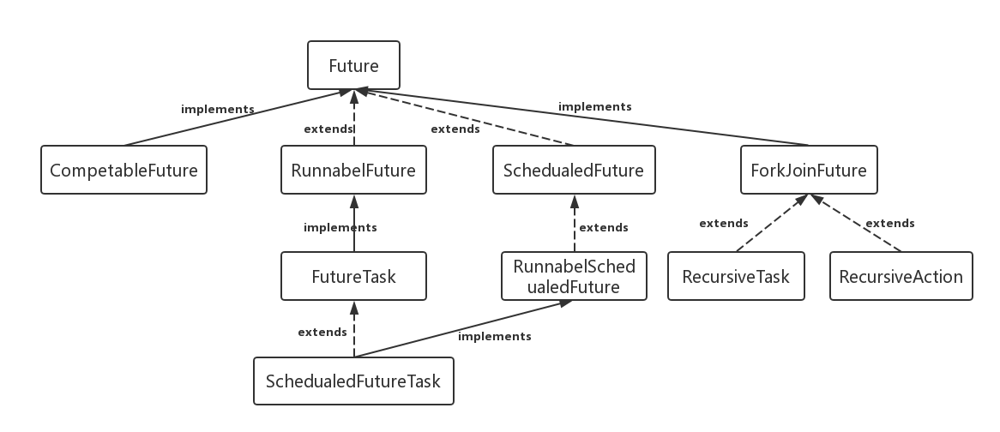

# Future

## 1. Future的应用场景
在并发编程中，我们经常用到非阻塞的模型，在之前的多线程的三种实现中，不管是继承thread类还是实现runnable接口，都无法保证获取到之前的执行结果。通过实现Callback接口，并用Future可以来接收多线程的执行结果。

Future表示一个可能还没有完成的异步任务的结果，针对这个结果可以添加Callback以便在任务执行成功或失败后作出相应的操作。

### Future的继承结构



### 1.1 Future接口

```Java
public interface Future<V> {

    /**
     * Attempts to cancel execution of this task.  This attempt will
     * fail if the task has already completed, has already been cancelled,
     * or could not be cancelled for some other reason. If successful,
     * and this task has not started when {@code cancel} is called,
     * this task should never run.  If the task has already started,
     * then the {@code mayInterruptIfRunning} parameter determines
     * whether the thread executing this task should be interrupted in
     * an attempt to stop the task.
     *
     * <p>After this method returns, subsequent calls to {@link #isDone} will
     * always return {@code true}.  Subsequent calls to {@link #isCancelled}
     * will always return {@code true} if this method returned {@code true}.
     */
    boolean cancel(boolean mayInterruptIfRunning);

    /**
     * Returns {@code true} if this task was cancelled before it completed
     * normally.
     *
     * @return {@code true} if this task was cancelled before it completed
     */
    boolean isCancelled();

    /**
     * Returns {@code true} if this task completed.
     *
     * Completion may be due to normal termination, an exception, or
     * cancellation -- in all of these cases, this method will return
     * {@code true}.
     */
    boolean isDone();

    /**
     * Waits if necessary for the computation to complete, and then
     * retrieves its result.
     */
    V get() throws InterruptedException, ExecutionException;

    /**
     * Waits if necessary for at most the given time for the computation
     * to complete, and then retrieves its result, if available.
     */
    V get(long timeout, TimeUnit unit)
        throws InterruptedException, ExecutionException, TimeoutException;
}

```

#### 对这几个方法做一些简要说明:

**get()方法**
> 可以当任务结束后返回一个结果，如果调用时，工作还没有结束，则会阻塞线程，直到任务执行完毕

**get(long timeout,TimeUnit unit)**
> 用来获取执行结果，如果在指定时间内，还没获取到结果，就直接返回null。

**cancel(boolean mayInterruptIfRunning)方法**
> 可以用来停止一个任务，如果取消任务成功则返回true，如果取消任务失败则返回false。参数mayInterruptIfRunning表示是否允许取消正在执行却没有执行完毕的任务，如果设置true，则表示可以取消正在执行过程中的任务。如果任务已经完成，则无论mayInterruptIfRunning为true还是false，此方法肯定返回false，即如果取消已经完成的任务会返回false；如果任务正在执行，若mayInterruptIfRunning设置为true，则返回true，若mayInterruptIfRunning设置为false，则返回false；如果任务还没有执行，则无论mayInterruptIfRunning为true还是false，肯定返回true。

**isDone()方法**
> 判断当前方法是否完成

**isCancel()方法**
> 判断当前方法是否取消

也就是说Future提供了三种功能：
- 判断任务是否完成；
- 能够中断任务；
- 能够获取任务执行结果。


**因为Future只是一个接口，所以是无法直接用来创建对象使用的，因此就有了下面的FutureTask。**

### 1.2 FutureTask类

更多关于FutureTask，请参考文章：[FutureTask](FutureTask.md)


---

参考文章：

- [JAVA Future类详解][1]
- [Java程序员必须掌握的线程知识-Callable和Future][2]


[1]:https://blog.csdn.net/u014209205/article/details/80598209
[2]:https://www.cnblogs.com/fengsehng/p/6048609.html

<!-- [3]:
[4]:
[5]:
[6]:
[7]:
[8]:
[9]:
[10]:
[11]:
[12]:
[13]:
[14]:
[15]:
[16]:
[17]:
[18]:
[19]: -->
