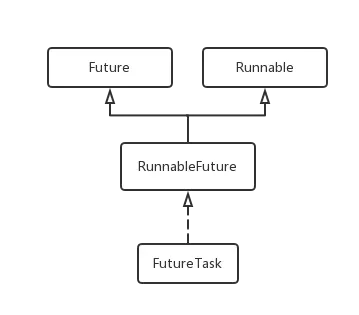

## 线程池的异常捕获

我们在使用线程池处理并行任务时，在线程池的生命周期当中，将通过某种抽象机制(Runnable)调用许多未知的代码，这些代码有可能是我们自己写的，也有可能来自第三方。任何代码都有可能抛出一个RuntimeException，如果这些提交的Runnable抛出了RuntimeException，线程池可以捕获他，线程池有可能会创建一个新的线程来代替这个因为抛出异常而结束的线程，也有可能什么也不做(这要看线程池的策略)。即使不会造成线程泄漏，我们也会丢失这个任务的执行情况，无法感知任务执行出现了异常。


### 单线程情况

```java
public class RewriteUncatchtExceptionHandler implements Thread.UncaughtExceptionHandler{
    public void uncaughtException(Thread t, Throwable e) {
        System.out.println("我捕获到了线程池的异常");
    }
}
```

```java
public class Task implements Runnable {
    public void run() {
        System.out.println("执行任务");
        int num  = Integer.parseInt("TT");
    }
}
```

```java
public static void catchSingleThread() {
     Task task = new Task();
     Thread thread = new Thread(task);
     thread.setUncaughtExceptionHandler(new RewriteUncatchtExceptionHandler());
     thread.start();
}
```
运行程序，我们发现可以正常的捕获到这个unchecked异常.


### 线程池

<!-- ```
public class MyThreadFactory implements ThreadFactory{
    public Thread newThread(Runnable r) {
        Thread t = new Thread(r);
        t.setUncaughtExceptionHandler(new RewriteUncatchtExceptionHandler());
        System.out.println("Thread[" + t.getName() + "] created.");
        return t;
    }
}
```

```
/**
   * 虽然从写ThreadFactory以后，可以捕获到异常，但是只能是execute,而submit还是不行  how to choose one
   */
  public static void catchedExecutor() {
      ExecutorService executorService = Executors.newCachedThreadPool(new MyThreadFactory());
      executorService.execute(new Task());
      executorService.shutdownNow();
  }
``` -->

条件Runable的方式：

```java
Future<?> submit(Runnable task);

void execute(Runnable command);
```


#### Future<?> submit(Runnable task)
但是他们在ThreadPoolExecutor中的实现方式是不同的。

```java
public Future<?> submit(Runnable task) {
    if (task == null) throw new NullPointerException();
    RunnableFuture<Void> ftask = newTaskFor(task, null);
    execute(ftask);
    return ftask;
}
```
使用exec.submit(runnable)这种方式提交任务时，submit方法会将我们的Runnable包装为一个RunnableFuture对象，这个对象实际上是FutureTask实例，然后将这个FutureTask交给execute方法执行。



Future用来管理任务的生命周期，将Future实例提交给异步线程执行后，可以调用Future.get方法获取任务执行的结果。我们知道Runnable执行是没有返回结果的，那么这个结果是怎么来的？

```java
protected <T> RunnableFuture<T> newTaskFor(Runnable runnable, T value) {
    return new FutureTask<T>(runnable, value);
}

public FutureTask(Runnable runnable, V result) {
    this.callable = Executors.callable(runnable, result);
    this.state = NEW;       // ensure visibility of callable
}

public static <T> Callable<T> callable(Runnable task, T result) {
    if (task == null)
        throw new NullPointerException();
    return new RunnableAdapter<T>(task, result);
}

public void execute(Runnable command) {
    if (command == null)
        throw new NullPointerException();

    int c = ctl.get();
    if (workerCountOf(c) < corePoolSize) {
        if (addWorker(command, true))
            return;
        c = ctl.get();
    }
    if (isRunning(c) && workQueue.offer(command)) {
        int recheck = ctl.get();
        if (! isRunning(recheck) && remove(command))
            reject(command);
        else if (workerCountOf(recheck) == 0)
            addWorker(null, false);
    }
    else if (!addWorker(command, false))
        reject(command);
}

```
可以看到，在FutureTask的构造方法中，将Runnable包装成了一个Callable类型的对象。

```java
public void run() {
    if (state != NEW ||
        !UNSAFE.compareAndSwapObject(this, runnerOffset,
                                     null, Thread.currentThread()))
        return;
    try {
        Callable<V> c = callable;
        if (c != null && state == NEW) {
            V result;
            boolean ran;
            try {
                result = c.call();
                ran = true;
            } catch (Throwable ex) {
                result = null;
                ran = false;
                setException(ex);
            }
            if (ran)
                set(result);
        }
    } finally {
        // runner must be non-null until state is settled to
        // prevent concurrent calls to run()
        runner = null;
        // state must be re-read after nulling runner to prevent
        // leaked interrupts
        int s = state;
        if (s >= INTERRUPTING)
            handlePossibleCancellationInterrupt(s);
    }
}
```
FutureTask的run方法中，调用了callable对象的call方法，也就调用了我们传入的Runnable对象的run方法。可以看到，如果代码(Runnable)抛出异常，会被捕获并且把这个异常保存下来。

```java
private V report(int s) throws ExecutionException {
    Object x = outcome;
    if (s == NORMAL)
        return (V)x;
    if (s >= CANCELLED)
        throw new CancellationException();
    throw new ExecutionException((Throwable)x);
}
```


#### Future<?> submit(Runnable task)
利用Future.get得到任务抛出的异常的缺点在于，我们需要显式的遍历Future，调用get方法获取每个任务执行抛出的异常，然后处理。

很多时候我们仅仅是使用exec.execute(runnable)这种方法来提交我们的任务。这种情况下任务抛出的异常如何处理呢？

在使用exec.execute(runnable)提交任务的时候(submit其实也是调用execute方法执行)，我们的任务最终会被一个Worker对象执行。这个Worker内部封装了一个Thread对象，这个Thread就是线程池的工作者线程。工作者线程会调用runWorker方法来执行我们提交的任务：(代码比较长，就直接粘过来了)

```java
private boolean addWorker(Runnable firstTask, boolean core) {
        retry:
        for (;;) {
            int c = ctl.get();
            int rs = runStateOf(c);

            // Check if queue empty only if necessary.
            if (rs >= SHUTDOWN &&
                ! (rs == SHUTDOWN &&
                   firstTask == null &&
                   ! workQueue.isEmpty()))
                return false;

            for (;;) {
                int wc = workerCountOf(c);
                if (wc >= CAPACITY ||
                    wc >= (core ? corePoolSize : maximumPoolSize))
                    return false;
                if (compareAndIncrementWorkerCount(c))
                    break retry;
                c = ctl.get();  // Re-read ctl
                if (runStateOf(c) != rs)
                    continue retry;
                // else CAS failed due to workerCount change; retry inner loop
            }
        }

        boolean workerStarted = false;
        boolean workerAdded = false;
        Worker w = null;
        try {
            w = new Worker(firstTask);
            final Thread t = w.thread;
            if (t != null) {
                final ReentrantLock mainLock = this.mainLock;
                mainLock.lock();
                try {
                    // Recheck while holding lock.
                    // Back out on ThreadFactory failure or if
                    // shut down before lock acquired.
                    int rs = runStateOf(ctl.get());

                    if (rs < SHUTDOWN ||
                        (rs == SHUTDOWN && firstTask == null)) {
                        if (t.isAlive()) // precheck that t is startable
                            throw new IllegalThreadStateException();
                        workers.add(w);
                        int s = workers.size();
                        if (s > largestPoolSize)
                            largestPoolSize = s;
                        workerAdded = true;
                    }
                } finally {
                    mainLock.unlock();
                }
                if (workerAdded) {
                    t.start();
                    workerStarted = true;
                }
            }
        } finally {
            if (! workerStarted)
                addWorkerFailed(w);
        }
        return workerStarted;
    }
```
上面代码的基本意思就是不停的从任务队列中取出任务执行，如果任务代码(task.run)抛出异常，会被最内层的try--catch块捕获，然后重新抛出。注意到最里面的finally块，在重新

抛出异常之前，要先执行afterExecute方法，这个方法的默认实现为空，即什么也不做。我们可以在这个方法上做点文章，这就是我们的第二种方法，

```JAVA
class ExtendedExecutor extends ThreadPoolExecutor {
   // ...
   protected void afterExecute(Runnable r, Throwable t) {
     super.afterExecute(r, t);
     if (t == null && r instanceof Future<?>) {
       try {
         Object result = ((Future<?>) r).get();
       } catch (CancellationException ce) {
           t = ce;
       } catch (ExecutionException ee) {
           t = ee.getCause();
       } catch (InterruptedException ie) {
           Thread.currentThread().interrupt(); // ignore/reset
       }
     }
     if (t != null)
       System.out.println(t);
   }
 }
```

可以看到，代码中还处理了task是FutureTask的情况。回想一下submit方式提交任务的情况

- 在submit方法中，我们传入的Runnable/Callable(要执行的任务)被封装为FutureTask对象，交给execute方法执行

- 经过一系列操作，提交的FutureTask对象被Worker对象中的工作者线程所执行，也就是runWorker方法。 此时的代码运行情况：runWorker->submit方法封装的FutureTask的run方法->我们提交的Runnable的run方法

- 此时从我们提交的Runnable的run方法中抛出了一个未检测异常RunnableException，被FutureTask的run方法捕获
- FutureTask的run方法捕获异常后保存，不再重新抛出。同时意味着run方法执行结束。
- runWorker方法没有检测到异常，task.run当作正常运行结束。但是还是会执行afterExecute方法。

#### 上面已经提到了两种解决任务代码抛出未检测异常的方案。接下来是第三种

当一个线程因为未捕获的异常而退出时，JVM会把这个事件报告给应用提供的UncaughtExceptionHandler异常处理器，如果没有提供任何的异常处理器，那么默认的行为就是将堆栈信息输送到System.err。

看一下上面的runWorker方法，如果task.run(任务代码)抛出了异常，异常会层层抛出，最终导致这个线程退出。此时这个抛出的异常就会传递到UncaughtExceptionHandler实例当中，由uncaughtException(Thread t,Throwable e)这个方法处理。

于是就有了第三种解决任务代码抛出异常的方案：为工作者线程设置UncaughtExceptionHandler，**在uncaughtException方法中处理异常**。 注意，这个方案不适用与使用submit方式提交任务的情况，原因上面也提到了，FutureTask的run方法捕获异常后保存，不再重新抛出，意味着runWorker方法并不会捕获到抛出的异常，线程也就不会退出，也不会执行我们设置的UncaughtExceptionHandler。

如何为工作者线程设置UncaughtExceptionHandler呢？ThreadPoolExecutor的构造函数提供一个ThreadFactory，可以在其中设置我们自定义的UncaughtExceptionHandler，这里不再赘述。

至于第四中方案，就很简单了：在我们提供的Runnable的run方法中捕获任务代码可能抛出的所有异常，包括未检测异常。这种方法比较简单，也有他的局限性，不够灵活，我们的处理被局限在了线程代码边界之内。


### 总结

通过上面的分析我们得到了四种解决任务代码抛异常的方案：

- 在我们提供的Runnable的run方法中捕获任务代码可能抛出的所有异常，包括未检测异常
- 使用ExecutorService.submit执行任务，利用返回的Future对象的get方法接收抛出的异常，然后进行处理
- 重写ThreadPoolExecutor.afterExecute方法，处理传递到afterExecute方法中的异常
- 为工作者线程设置UncaughtExceptionHandler，在uncaughtException方法中处理异常

要注意的是，使用最后一种方案时，无法处理以submit的方式提交的任务。
