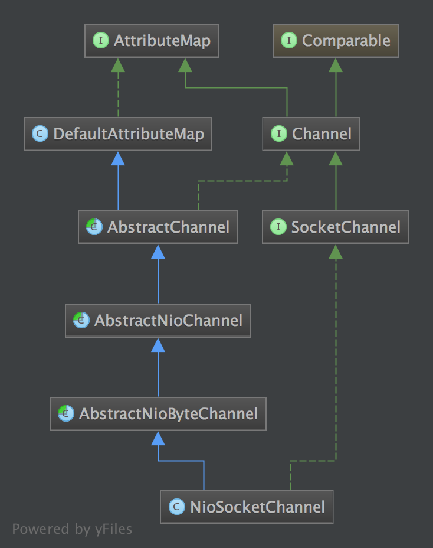

# NioSocketChannel 的初始化过程

首先我们可以以客户端的代码为例，一步一步进入源码:
Bootstrap 是 Netty 提供的一个便利的工厂类, 我们可以通过它来完成 Netty 的客户端或服务器端的 Netty 初始化. 下面我以 Netty 源码例子中的 Time 作为例子, 从客户端和服务器端分别分析一下Netty 的程序是如何启动的.
> 源码可以在[github][1]上看到.
> 需要注意的是，为了文章

```java
public class TimeClient {
    public void connect(int port, String host) throws Exception {
        EventLoopGroup group = new NioEventLoopGroup();
        try{
            Bootstrap bootstrap = new Bootstrap();
            bootstrap.group(group).channel(NioSocketChannel.class)
                    .option(ChannelOption.TCP_NODELAY,true)
                    .handler(new ChannelInitializer<SocketChannel>() {
                        @Override
                        protected void initChannel(SocketChannel ch) throws Exception {
                            ch.pipeline().addLast(new TimeClientHandler());
                        }
                    });

            ChannelFuture future = bootstrap.connect(host, port).sync();
            future.channel().closeFuture().sync();
        }finally {
            group.shutdownGracefully();
        }
    }
    public static void main(String[] args) {
        try {
            new TimeClient().connect(18080,"127.0.0.1");
        } catch (Exception e) {
            e.printStackTrace();
        }
    }
}
```

首先我们可以着重分析一下写这段代码：
```java
//赋值
Bootstrap bootstrap = new Bootstrap();
 bootstrap.group(group).channel(NioSocketChannel.class)
         .option(ChannelOption.TCP_NODELAY,true)
         .handler(new ChannelInitializer<SocketChannel>() {
             @Override
             protected void initChannel(SocketChannel ch) throws Exception {
                 ch.pipeline().addLast(new TimeClientHandler());
             }
         });
//实例化
 ChannelFuture future = bootstrap.connect(host, port).sync();
 future.channel().closeFuture().sync();
```

通过阅读Bootstrap的源码可以看到， 第一个步骤主要是对bootstrap进行复制， 真正去实例化的过程是在`bootstrap.connect(host, port).sync()`中进行的.

从上面的客户端代码虽然简单, 但是却展示了 Netty 客户端初始化时所需的所有内容:

1. EventLoopGroup: 不论是服务器端还是客户端, 都必须指定 EventLoopGroup. 在这个例子中, 指定了 NioEventLoopGroup, 表示一个 NIO 的EventLoopGroup.
2. ChannelType: 指定 Channel 的类型. 因为是客户端, 因此使用了 NioSocketChannel.
3. Handler: 设置数据的处理器.

下面我们深入代码, 看一下客户端通过 Bootstrap 启动后, 都做了哪些工作.

## `NioSocketChannel` 初始化过程
在 Netty 中, Channel 是一个 Socket 的抽象, 它为用户提供了关于 Socket 状态(是否是连接还是断开) 以及对 Socket 的读写等操作. 每当 Netty 建立了一个连接后, 都会有一个对应的 Channel 实例. NioSocketChannel 的类层次结构如下:



除了 TCP 协议以外, Netty 还支持很多其他的连接协议, 并且每种协议还有 NIO(异步 IO) 和 OIO(Old-IO, 即传统的阻塞 IO) 版本的区别. 不同协议不同的阻塞类型的连接都有不同的

- `Channel` 类型与之对应下面是一些常用的 `Channel` 类型:
- `NioSocketChannel`, 代表异步的客户端 `TCP Socket` 连接.
- `NioServerSocketChannel`, 异步的服务器端 `TCP Socket` 连接.
- `NioDatagramChannel`, 异步的 `UDP` 连接
- `NioSctpChannel`, 异步的客户端 `Sctp` 连接.
- `NioSctpServerChannel`, 异步的 `Sctp` 服务器端连接.
- `OioSocketChannel`, 同步的客户端 `TCP Socket` 连接.
- `OioServerSocketChannel`, 同步的服务器端 `TCP Socket` 连接.
- `OioDatagramChannel`, 同步的 `UDP` 连接
- `OioSctpChannel`, 同步的 `Sctp` 服务器端连接.
- `OioSctpServerChannel`, 同步的客户端 `TCP Socket` 连接.

我们再回来
首先通过构造函数的调用我们可以知道,最终会调用到`doConnect`方法。

```java
public ChannelFuture connect(String inetHost, int inetPort) {
    return connect(new InetSocketAddress(inetHost, inetPort));
}
public ChannelFuture connect(SocketAddress remoteAddress) {
    if (remoteAddress == null) {
        throw new NullPointerException("remoteAddress");
    }
    validate();
    return doConnect(remoteAddress, localAddress());
}
```

`BootStrap`会通过执行`connect`方法去真正的连接`server`, 方法`connect(String inetHost, int inetPort)`又会通过检查，校验之后执行`doConnect(final SocketAddress remoteAddress, final SocketAddress localAddress)`:

```java
private ChannelFuture doConnect(final SocketAddress remoteAddress, final SocketAddress localAddress) {
    final ChannelFuture regFuture = initAndRegister();
    final Channel channel = regFuture.channel();
    final ChannelPromise promise = channel.newPromise();

    doConnect0(regFuture, channel, remoteAddress, localAddress, promise);
    return promise;
}
```

### `NioSocketChannel`实例化

```java
final ChannelFuture initAndRegister() {
    Channel channel = createChannel();

    init(channel);

    ChannelPromise regFuture = channel.newPromise();
    channel.unsafe().register(regFuture);
    return regFuture;
}
```

#### `createChannel()`
首先，会先创建一个`channel`, 这个方法很简单，就是通过`ChannelFactory`来创建一个`channel`
```java
Channel createChannel() {
    EventLoop eventLoop = group().next();
    return channelFactory().newChannel(eventLoop);
}
private static final class BootstrapChannelFactory<T extends Channel> implements ChannelFactory<T> {
    @Override
    public T newChannel(EventLoop eventLoop) {
            Constructor<? extends T> constructor = clazz.getConstructor(EventLoop.class);
            return constructor.newInstance(eventLoop);
    }
}
```
那么我们是如何设置所需要的 Channel 的类型的呢? 答案是 channel() 方法的调用. 回想一下我们在客户端连接代码的初始化 Bootstrap 中, 会调用 channel() 方法, 传入 NioSocketChannel.class。

> BootstrapChannelFactory类里的field就是我们在初始化BootStrap的时候填入的channel：
> ```java
> public Bootstrap channel(Class<? extends Channel> channelClass) {
>    if (channelClass == null) {
>        throw new NullPointerException("channelClass");
>    }
>    return channelFactory(new BootstrapChannelFactory<Channel>(channelClass));
> }
> ```

Bootstrap 中的 ChannelFactory 的实现是 BootstrapChannelFactory
生成的 Channel 的具体类型是 NioSocketChannel. Channel 的实例化过程, 其实就是调用的 ChannelFactory#newChannel 方法, 而实例化的 Channel 的具体的类型又是和在初始化 Bootstrap 时传入的 channel() 方法的参数相关. 因此对于我们这个例子中的客户端的 Bootstrap 而言, 生成的的 Channel 实例就是 NioSocketChannel.

在`BootstrapChannelFactory`的newChannel方法中，NioSocketChannel正式被调用并且被初始化，调用了`NioSocketChannel(EventLoop eventLoop)`构造方法.

接下来是NioSocketChannel的初始化过程:
```java

private static SocketChannel newSocket() {
    try {
        return SocketChannel.open();
    } catch (IOException e) {
        throw new ChannelException("Failed to open a socket.", e);
    }
}

public NioSocketChannel(EventLoop eventLoop) {
    this(eventLoop, newSocket());
}

public NioSocketChannel(Channel parent, EventLoop eventLoop, SocketChannel socket) {
    super(parent, eventLoop, socket);
    config = new DefaultSocketChannelConfig(this, socket.socket());
}

protected AbstractNioChannel(Channel parent, EventLoop eventLoop, SelectableChannel ch, int readInterestOp) {
    super(parent, eventLoop);
    this.ch = ch;
    this.readInterestOp = readInterestOp;
    ch.configureBlocking(false);
}
protected AbstractChannel(Channel parent, EventLoop eventLoop) {
    this.parent = parent;
    this.eventLoop = validate(eventLoop);
    unsafe = newUnsafe();
    pipeline = new DefaultChannelPipeline(this);
}
```

这些构造函数存在很大的依赖关系，或者说`NioSocketChannel`的类继承关系比较深，我们一步一步看， 这里牵涉了以下步骤:
- 创建一个`SocketChannel`
- 给`NioSocketChannel`一个默认的`SelectionKey`， 默认值为`SelectionKey.OP_READ`。
- 创建一个默认的`pipeline`, 关于`pipiline`，会单独细说.
- 把创建的`socketChannel` 赋值给`SelectableChannel`, 或者说，在这里，`NioSocketChannel`其实就是通过操作最开始创建的`SocketChannel`
- 把`SocketChanne`l设置为非阻塞.

到这里，我们一个完整地创建`NioSocketChannel`的过程就很清晰了， 其实也可以说`NioSocketChannel`主要做了两件事儿， 创建了一个`SocketChannel`，创建了一个`pipeline`.

`接下来我们看看SocketChannel的init过程`

#### init(channel)
```java
void init(Channel channel) throws Exception {
    ChannelPipeline p = channel.pipeline();
    p.addLast(handler());

    final Map<ChannelOption<?>, Object> options = options();
    synchronized (options) {
        for (Entry<ChannelOption<?>, Object> e: options.entrySet()) {
            try {
                if (!channel.config().setOption((ChannelOption<Object>) e.getKey(), e.getValue())) {
                    logger.warn("Unknown channel option: " + e);
                }
              }
        }
    }
    final Map<AttributeKey<?>, Object> attrs = attrs();
    synchronized (attrs) {
        for (Entry<AttributeKey<?>, Object> e: attrs.entrySet()) {
            channel.attr((AttributeKey<Object>) e.getKey()).set(e.getValue());
        }
    }
}
```

这个类主要做了三件事儿
- 把`handler`添加到`pipeline`
- 把`options`赋值到该去的地方
- 把`attrs`赋值到该去的地方

#### `channel` 的注册过程

在前面的分析中, 我们提到, `channel` 会在 `Bootstrap.initAndRegister` 中进行初始化, 但是这个方法还会将初始化好的 `Channel` 注册到 `EventGroup` 中. 接下来我们就来分析一下 `Channel` 注册的过程. 回顾一下 `AbstractBootstrap.initAndRegister` 方法:

```java
final ChannelFuture initAndRegister() {
	// 去掉非关键代码
    final Channel channel = channelFactory().newChannel();
    init(channel);
    ChannelFuture regFuture = group().register(channel);
}
```

当`Channel` 初始化后, 会紧接着调用` group().register()` 方法来注册 `Channel`, 我们继续跟踪的话, 会发现其调用链如下: `AbstractBootstrap.initAndRegister -> MultithreadEventLoopGroup.register -> SingleThreadEventLoop.register -> AbstractUnsafe.register` 通过跟踪调用链, 最终我们发现是调用到了 `unsafe` 的 `register` 方法, 那么接下来我们就仔细看一下 `AbstractUnsafe.register` 方法中到底做了什么:

```java
@Override
public final void register(EventLoop eventLoop, final ChannelPromise promise) {
	// 省略条件判断和错误处理
    AbstractChannel.this.eventLoop = eventLoop;
    register0(promise);
}
```

首先, 将 `eventLoop` 赋值给 `Channel` 的 `eventLoop` 属性, 而我们知道这个 `eventLoop` 对象其实是 `MultithreadEventLoopGroup.next()` 方法获取的, 根据我们前面 关于 `EventLoop` 初始化 小节中, 我们可以确定 `next()` 方法返回的 `eventLoop` 对象是 `NioEventLoop` 实例. `register` 方法接着调用了 `register0` 方法:

```java
private void register0(ChannelPromise promise) {
    boolean firstRegistration = neverRegistered;
    doRegister();
    neverRegistered = false;
    registered = true;
    safeSetSuccess(promise);
    pipeline.fireChannelRegistered();
    if (firstRegistration && isActive()) {
        pipeline.fireChannelActive();
    }
}
```
`register0` 又调用了 `AbstractNioChannel.doRegister`:

```java
protected void doRegister() throws Exception {
	// 省略错误处理
    selectionKey = javaChannel().register(eventLoop().selector, 0, this);
}
```
`javaChannel()` 这个方法在前面我们已经知道了, 它返回的是一个 `Java NIO SocketChannel`, 这里我们将这个 `SocketChannel` 注册到与 `eventLoop` 关联的 `selector` 上了.

我们总结一下 `Channel` 的注册过程:

- 首先在 `AbstractBootstrap.initAndRegister`中, 通过 `group().register(channel)`, 调用 `MultithreadEventLoopGroup.register` 方法
- 在`MultithreadEventLoopGroup.register` 中, 通过 `next()` 获取一个可用的 `SingleThreadEventLoop`, 然后调用它的 `register`
- 在 `SingleThreadEventLoop.register` 中, 通过 `channel.unsafe().register(this, promise)` 来获取 `channel` 的 `unsafe()` 底层操作对象, 然后调用它的 `register`.
- 在 `AbstractUnsafe.register` 方法中, 调用 `register0` 方法注册 `Channel`
- 在 `AbstractUnsafe.register0` 中, 调用 `AbstractNioChannel.doRegister` 方法
- `AbstractNioChannel.doRegister` 方法通过 `javaChannel().register(eventLoop().selector, 0, this)` 将 `Channel` 对应的 `Java NIO SockerChannel` 注册到一个 `eventLoop` 的 `Selector` 中, 并且将当前 `Channel` 作为 `attachment`.

总的来说, Channel 注册过程所做的工作就是将 Channel 与对应的 EventLoop 关联, 因此这也体现了, 在 Netty 中, 每个 Channel 都会关联一个特定的 EventLoop, 并且这个 Channel 中的所有 IO 操作都是在这个 EventLoop 中执行的; 当关联好 Channel 和 EventLoop 后, 会继续调用底层的 Java NIO SocketChannel 的 register 方法, 将底层的 Java NIO SocketChannel 注册到指定的 selector 中. 通过这两步, 就完成了 Netty Channel 的注册过程.

### handler 的添加过程
Netty 的一个强大和灵活之处就是基于 Pipeline 的自定义 handler 机制. 基于此, 我们可以像添加插件一样自由组合各种各样的 handler 来完成业务逻辑. 例如我们需要处理 HTTP 数据, 那么就可以在 pipeline 前添加一个 Http 的编解码的 Handler, 然后接着添加我们自己的业务逻辑的 handler, 这样网络上的数据流就向通过一个管道一样, 从不同的 handler 中流过并进行编解码, 最终在到达我们自定义的 handler 中. 既然说到这里, 有些读者朋友肯定会好奇, 既然这个 pipeline 机制是这么的强大, 那么它是怎么实现的呢? 不过我这里不打算详细展开 Netty 的 ChannelPipeline 的实现机制(具体的细节会在后续的章节中展示), 我在这一小节中, 从简单的入手, 展示一下我们自定义的 handler 是如何以及何时添加到 ChannelPipeline 中的. 首先让我们看一下如下的代码片段:

```java
.handler(new ChannelInitializer<SocketChannel>() {
     @Override
     public void initChannel(SocketChannel ch) throws Exception {
         ChannelPipeline p = ch.pipeline();
         if (sslCtx != null) {
             p.addLast(sslCtx.newHandler(ch.alloc(), HOST, PORT));
         }
         //p.addLast(new LoggingHandler(LogLevel.INFO));
         p.addLast(new EchoClientHandler());
     }
 });
```
这个代码片段就是实现了 handler 的添加功能. 我们看到, Bootstrap.handler 方法接收一个 ChannelHandler, 而我们传递的是一个 派生于 ChannelInitializer 的匿名类, 它正好也实现了 ChannelHandler 接口. 我们来看一下, ChannelInitializer 类内到底有什么玄机:

```java
@Sharable
public abstract class ChannelInitializer<C extends Channel> extends ChannelInboundHandlerAdapter {

    private static final InternalLogger logger = InternalLoggerFactory.getInstance(ChannelInitializer.class);
    protected abstract void initChannel(C ch) throws Exception;

    @Override
    @SuppressWarnings("unchecked")
    public final void channelRegistered(ChannelHandlerContext ctx) throws Exception {
        initChannel((C) ctx.channel());
        ctx.pipeline().remove(this);
        ctx.fireChannelRegistered();
    }
    ...
}
```

ChannelInitializer 是一个抽象类, 它有一个抽象的方法 initChannel, 我们正是实现了这个方法, 并在这个方法中添加的自定义的 handler 的. 那么 initChannel 是哪里被调用的呢? 答案是 ChannelInitializer.channelRegistered 方法中. 我们来关注一下 channelRegistered 方法. 从上面的源码中, 我们可以看到, 在 channelRegistered 方法中, 会调用 initChannel 方法, 将自定义的 handler 添加到 ChannelPipeline 中, 然后调用 ctx.pipeline().remove(this) 将自己从 ChannelPipeline 中删除. 上面的分析过程, 可以用如下图片展示: 一开始, ChannelPipeline 中只有三个 handler, head, tail 和我们添加的 ChannelInitializer.


接着 initChannel 方法调用后, 添加了自定义的 handler:


最后将 ChannelInitializer 删除:


析到这里, 我们已经简单了解了自定义的 handler 是如何添加到 ChannelPipeline 中的, 不过限于主题与篇幅的原因, 我没有在这里详细展开 ChannelPipeline 的底层机制, 我打算在下一篇 Netty 源码分析之 二 贯穿Netty 的大动脉 ── ChannelPipeline 中对这个问题进行深入的探讨.


### 客户端连接分析
经过上面的各种分析后, 我们大致了解了 `Netty` 初始化时, 所做的工作, 那么接下来我们就直奔主题, 分析一下客户端是如何发起 `TCP` 连接的.

首先, 客户端通过调用 `Bootstrap` 的 `connect` 方法进行连接. 在 `connect` 中, 会进行一些参数检查后, 最终调用的是 `doConnect0` 方法, 其实现如下:

```java
private static void doConnect0(
        final ChannelFuture regFuture, final Channel channel,
        final SocketAddress remoteAddress, final SocketAddress localAddress, final ChannelPromise promise) {

    // This method is invoked before channelRegistered() is triggered.  Give user handlers a chance to set up
    // the pipeline in its channelRegistered() implementation.
    channel.eventLoop().execute(new Runnable() {
        @Override
        public void run() {
            if (regFuture.isSuccess()) {
                if (localAddress == null) {
                    channel.connect(remoteAddress, promise);
                } else {
                    channel.connect(remoteAddress, localAddress, promise);
                }
                promise.addListener(ChannelFutureListener.CLOSE_ON_FAILURE);
            } else {
                promise.setFailure(regFuture.cause());
            }
        }
    });
}
```

在 `doConnect0` 中, 会在 `event loop` 线程中调用 `Channel` 的 `connect` 方法, 而这个 `Channel` 的具体类型是什么呢? 我们在 `Channel` 初始化这一小节中已经分析过了, 这里 `channel` 的类型就是 `NioSocketChannel`. 进行跟踪到 `channel.connect` 中, 我们发现它调用的是 `DefaultChannelPipeline#connect`, 而, `pipeline` 的 `connect` 代码如下:

```java
@Override
public ChannelFuture connect(SocketAddress remoteAddress) {
    return tail.connect(remoteAddress);
}
```

而 `tail` 字段, 我们已经分析过了, 是一个 `TailContext` 的实例, 而 `TailContext` 又是 `AbstractChannelHandlerContext` 的子类, 并且没有实现 `connect` 方法, 因此这里调用的其实是 `AbstractChannelHandlerContext.connect`, 我们看一下这个方法的实现:
```java
@Override
public ChannelFuture connect(
        final SocketAddress remoteAddress, final SocketAddress localAddress, final ChannelPromise promise) {

	// 删除的参数检查的代码
    final AbstractChannelHandlerContext next = findContextOutbound();
    EventExecutor executor = next.executor();
    if (executor.inEventLoop()) {
        next.invokeConnect(remoteAddress, localAddress, promise);
    } else {
        safeExecute(executor, new OneTimeTask() {
            @Override
            public void run() {
                next.invokeConnect(remoteAddress, localAddress, promise);
            }
        }, promise, null);
    }

    return promise;
}
```

上面的代码中有一个关键的地方, 即` final AbstractChannelHandlerContext next = findContextOutbound()`, 这里调用 `findContextOutbound` 方法, 从 `DefaultChannelPipeline` 内的双向链表的 `tail` 开始, 不断向前寻找第一个 `outbound` 为 `true` 的 `AbstractChannelHandlerContext`, 然后调用它的 `invokeConnect` 方法, 其代码如下:
```java
private void invokeConnect(SocketAddress remoteAddress, SocketAddress localAddress, ChannelPromise promise) {
    // 忽略 try 块
    ((ChannelOutboundHandler) handler()).connect(this, remoteAddress, localAddress, promise);
}
```

开始提到, 在 `DefaultChannelPipeline` 的构造器中, 会实例化两个对象: `head` 和 `tail`, 并形成了双向链表的头和尾. `head` 是 `HeadContext` 的实例, 它实现了 `ChannelOutboundHandler` 接口, 并且它的 `outbound` 字段为 `true`. 因此在 `findContextOutbound` 中, 找到的 `AbstractChannelHandlerContext` 对象其实就是 head. 进而在 `invokeConnect` 方法中, 我们向上转换为 `ChannelOutboundHandler` 就是没问题的了. 而又因为 `HeadContext` 重写了 `connect` 方法, 因此实际上调用的是 `HeadContext.connect`. 我们接着跟踪到 `HeadContext.connect`, 其代码如下:
```java
@Override
public void connect(
        ChannelHandlerContext ctx,
        SocketAddress remoteAddress, SocketAddress localAddress,
        ChannelPromise promise) throws Exception {
    unsafe.connect(remoteAddress, localAddress, promise);
}
```
这个 `connect` 方法很简单, 仅仅调用了 `unsafe` 的 `connect` 方法. 而 `unsafe` 又是什么呢,  回顾一下 `HeadContext` 的构造器, 我们发现 `unsafe` 是 `pipeline.channel().unsafe()` 返回的, 而 `Channel` 的 `unsafe` 字段, 在这个例子中, 我们已经知道了, 其实是 `AbstractNioByteChannel.NioByteUnsafe` 内部类. 兜兜转转了一大圈, 我们找到了创建 `Socket` 连接的关键代码. 进行跟踪 `NioByteUnsafe -> AbstractNioUnsafe.connect`:

```java
@Override
public final void connect(
        final SocketAddress remoteAddress, final SocketAddress localAddress, final ChannelPromise promise) {
    boolean wasActive = isActive();
    if (doConnect(remoteAddress, localAddress)) {
        fulfillConnectPromise(promise, wasActive);
    } else {
        ...
    }
}
```

`AbstractNioUnsafe.connect` 的实现如上代码所示, 在这个 `connect` 方法中, 调用了 `doConnect` 方法, 注意, 这个方法并不是 `AbstractNioUnsafe` 的方法, 而是 `AbstractNioChannel` 的抽象方法. `doConnect` 方法是在 `NioSocketChannel` 中实现的, 因此进入到 `NioSocketChannel.doConnect` 中:
```java
@Override
protected boolean doConnect(SocketAddress remoteAddress, SocketAddress localAddress) throws Exception {
    if (localAddress != null) {
        javaChannel().socket().bind(localAddress);
    }

    boolean success = false;
    try {
        boolean connected = javaChannel().connect(remoteAddress);
        if (!connected) {
            selectionKey().interestOps(SelectionKey.OP_CONNECT);
        }
        success = true;
        return connected;
    } finally {
        if (!success) {
            doClose();
        }
    }
}
```

我们终于看到的最关键的部分了, 庆祝一下! 上面的代码不用多说, 首先是获取 `Java NIO SocketChannel`, 即我们已经分析过的, 从 ``NioSocketChannel.newSocket`` 返回的 `SocketChannel` 对象; 然后是调用 `SocketChannel.connect` 方法完成 ``Java NIO`` 层面上的 `Socket` 的连接. 最后, 上面的代码流程可以用如下时序图直观地展示: 
