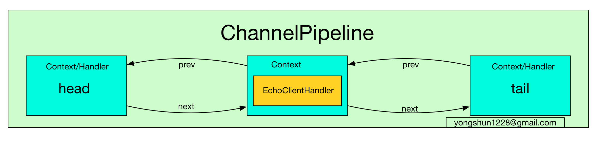

# ChannelPipeline

## Channel 与 ChannelPipeline

相信大家都知道了, 在 Netty 中每个 Channel 都有且仅有一个 ChannelPipeline 与之对应, 它们的组成关系如下:


通过上图我们可以看到, 一个 Channel 包含了一个 ChannelPipeline, 而 ChannelPipeline 中又维护了一个由 ChannelHandlerContext 组成的双向链表. 这个链表的头是 HeadContext, 链表的尾是 TailContext, 并且每个 ChannelHandlerContext 中又关联着一个 ChannelHandler. 上面的图示给了我们一个对 ChannelPipeline 的直观认识。

那么代码中是怎么实现的呢，我们可以深入到代码中详细的看看结果.

我们在浏览Channel的代码的时候，就发现，每个Channel的初始化的时候，就会自动在内部创建一个Pipeline。

```java
protected AbstractChannel(Channel parent) {
    this.parent = parent;
    id = DefaultChannelId.newInstance();
    unsafe = newUnsafe();
    pipeline = new DefaultChannelPipeline(this);
}
```

AbstractChannel 有一个 pipeline 字段, 在构造器中会初始化它为 DefaultChannelPipeline的实例. 这里的代码就印证了一点: `每个 Channel 都有一个 ChannelPipeline`. 接着我们跟踪一下 DefaultChannelPipeline 的初始化过程. 首先进入到 DefaultChannelPipeline 构造器中:

```java
DefaultChannelPipeline(AbstractChannel channel) {
    if (channel == null) {
        throw new NullPointerException("channel");
    }
    this.channel = channel;

    tail = new TailContext(this);
    head = new HeadContext(this);

    head.next = tail;
    tail.prev = head;
}
```

在 `DefaultChannelPipeline` 构造器中, 首先将与之关联的 `Channel` 保存到字段 `channel` 中, 然后实例化两个 `ChannelHandlerContext`, 一个是 `HeadContext` 实例 `head`, 另一个是 `TailContext` 实例 `tail`. 接着将 `head` 和 `tail` 互相指向, 构成一个双向链表. 特别注意到, 我们在开始的示意图中, `head` 和 `tail` 并没有包含 `ChannelHandler`, 这是因为 `HeadContext` 和 `TailContext` 继承于 `AbstractChannelHandlerContext` 的同时也实现了 `ChannelHandler` 接口了, 因此它们有 `Context` 和 `Handler` 的双重属性.

其实在 DefaultChannelPipeline 中, 维护了一个以 AbstractChannelHandlerContext 为节点的双向链表, 这个链表是 Netty 实现 Pipeline 机制的关键.

下面看看Tail和Head的来继承结构：


从类层次结构图中可以很清楚地看到, head 实现了 ChannelInboundHandler, 而 tail 实现了 ChannelOutboundHandler 接口, 并且它们都实现了 ChannelHandlerContext 接口, 因此可以说 head 和 tail 即是一个 ChannelHandler, 又是一个 ChannelHandlerContext.

下面我们以HeadContext为例子看一下:
```java
HeadContext(DefaultChannelPipeline pipeline) {
    super(pipeline, null, HEAD_NAME, false, true);
    unsafe = pipeline.channel().unsafe();
}
```

它调用了父类 `AbstractChannelHandlerContext` 的构造器, 并传入参数 `inbound = false`, `outbound = true`. `TailContext` 的构造器与 `HeadContext` 的相反, 它调用了父类 `AbstractChannelHandlerContext` 的构造器, 并传入参数`inbound = true`, `outbound = false`. 即 `header` 是一个 `outboundHandler`, 而 `tail` 是一个`inboundHandler`, 关于这一点, 大家要特别注意, 因为在后面的分析中, 我们会反复用到 `inbound` 和 `outbound` 这两个属性.

## 链表的节点 ChannelHandlerContext

我们已经分析了 Channel 的组成, 其中我们了解到, 最开始的时候 ChannelPipeline 中含有两个 ChannelHandlerContext(同时也是 ChannelHandler), 但是这个 Pipeline并不能实现什么特殊的功能, 因为我们还没有给它添加自定义的 ChannelHandler. 通常来说, 我们在初始化 Bootstrap, 会添加我们自定义的 ChannelHandler.
在本文的上下文中，我们是使用的自定义的TimeClientHandler
```java
bootstrap.group(group).channel(NioSocketChannel.class)
        .option(ChannelOption.TCP_NODELAY,true)
        .handler(new ChannelInitializer<SocketChannel>() {
            @Override
            protected void initChannel(SocketChannel ch) throws Exception {
                ch.pipeline().addLast(new TimeClientHandler());
            }
        });
```
上面代码的初始化过程, 在调用 handler 时, 传入了 ChannelInitializer 对象, 它提供了一个 initChannel 方法供我们初始化 ChannelHandler.

ChannelInitializer 实现了 ChannelHandler, 那么它是在什么时候添加到 ChannelPipeline 中的呢?
还记的在initAndRegister()方法吗，这个方法主要做的事情，就是首先创建一个Channel然后init, 我们自定义的handler就是在这个时候被添加到ChannelPipeline的.
```java
void init(Channel channel) throws Exception {
    ChannelPipeline p = channel.pipeline();
    p.addLast(handler());
    ...
}
```
上面的代码将 handler() 返回的 ChannelHandler 添加到 Pipeline 中, 而 handler() 返回的是handler 其实就是我们在初始化 Bootstrap 调用 handler 设置的 ChannelInitializer 实例, 因此这里就是将 ChannelInitializer 插入到了 Pipeline 的末端. 此时 Pipeline 的结构如下图所示:



在`Bootstrap.init`中会调用`p.addLast()`方法, 将`ChannelInitializer`插入到链表末端:
在`ChannelPipeline`中的双向链表中的元素是一个`ChannelHandlerContext`

我们插入的是一个ChannelInitializer 实例，会在处理过程中，被包装成一个ChannelHandlerContext类.

addLast 有很多重载的方法, 我们关注这个比较重要的方法就可以了. 上面的 addLast 方法中, 首先检查这个 ChannelHandler 的名字是否是重复的, 如果不重复的话, 则为这个 Handler 创建一个对应的 DefaultChannelHandlerContext 实例, 并与之关联起来(Context 中有一个 handler 属性保存着对应的 Handler 实例). 判断此 Handler 是否重名的方法很简单: Netty 中有一个 name2ctx Map 字段, key 是 handler 的名字, 而 value 则是 handler 本身. 因此通过如下代码就可以判断一个 handler 是否重名了:

```java
public ChannelPipeline addLast(ChannelHandlerInvoker invoker, String name, ChannelHandler handler) {
    synchronized (this) {
        name = filterName(name, handler);
        addLast0(name, new DefaultChannelHandlerContext(this, invoker, name, handler));
    }
    return this;
}
```
可以发现, ChannelInitializer首先是ChannelHandler的一个子类， ChannelHandler会被包装秤一个DefaultChannelHandlerContext类型.

```java
DefaultChannelHandlerContext(
        DefaultChannelPipeline pipeline, EventExecutorGroup group, String name, ChannelHandler handler) {
    super(pipeline, group, name, isInbound(handler), isOutbound(handler));
    if (handler == null) {
        throw new NullPointerException("handler");
    }
    this.handler = handler;
}
```
inbound 和 outbound 两个字段, 其实这两个字段关系到 pipeline 的事件的流向与分类, 因此是十分关键的, 后面我们再来详细分析这两个字段所起的作用. 在这里, 只需要记住, ChannelInitializer 所对应的 DefaultChannelHandlerContext 的 inbound = true, outbound = false 即可. 或者可以这么理解，ChannelInitializer实现了ChannelInboundHandler接口.

最后执行addLast0方法把ChannelHandler插入pipeline:
```java
private void addLast0(final String name, AbstractChannelHandlerContext newCtx) {
    checkMultiplicity(newCtx);

    AbstractChannelHandlerContext prev = tail.prev;
    newCtx.prev = prev;
    newCtx.next = tail;
    prev.next = newCtx;
    tail.prev = newCtx;

    name2ctx.put(name, newCtx);

    callHandlerAdded(newCtx);
}

```
显然, 这个代码就是典型的双向链表的插入操作了. 当调用了 addLast 方法后, Netty 就会将此 handler 添加到双向链表中 tail 元素之前的位置.

## 自定义 ChannelHandler 的添加过程
在上一小节中, 我们已经分析了一个 ChannelInitializer 如何插入到 Pipeline 中的, 接下来就来探讨一下 ChannelInitializer 在哪里被调用, ChannelInitializer 的作用, 以及我们自定义的 ChannelHandler 是如何插入到 Pipeline 中的.


/
