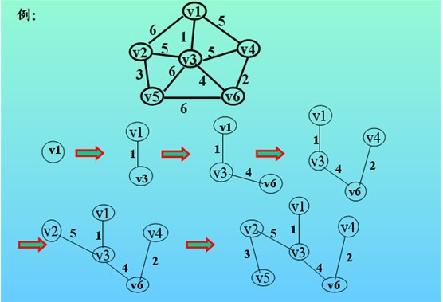

# 最小生成树算法

- `连通图`：在无向图G中，若从顶点i到顶点j有路径，则称顶点i和顶点j是连通的。若图G中任意两个顶点都连通，则称G为连通图。

- `生成树`：一个连通图的生成树是该连通图的一个极小连通子图，它含有全部顶点，但只有构成一个数的`(n-1)`条边。

- `最小生成树`：对于一个带权连通无向图G中的不同生成树，各树的边上的 **权值之和最小**。构造最小生成树的准则有三条：
    - 必须只使用该图中的边来构造最小生成树。
    - 必须使用且仅使用`(n-1)`条边来连接图中的n个顶点。
    - 不能使用产生回路的边。

### Prim算法

假设G=(V,E)是一个具有n个顶点的带权连通无向图，T(U,TE)是G的最小生成树，其中U是T的顶点集，TE是T的边集，则由G构造从起始顶点v出发的最小生成树T的步骤为：

  - 初始化U={v}，以v到其他顶点的所有边为候选边(U中所有点到其他顶点的边)。

  - 重复以下步骤(n-1)次，使得其他(n-1)个顶点被加入到U中。

    - 从候选边中挑选权值最小的边加入TE，设该边在`V-U`(这里是集合减)中的顶点是k，将k加入U中。
    
    - 考察当前V-U中的所有顶点j，修改候选边，若边(k,j)的权值小于原来和顶点j关联的候选边，则用(k,j)取代后者作为候选边。

### Kruskal算法

假设G=(V,E)是一个具有n个顶点的带权连通无向图，T(U,TE)是G的最小生成树，其中U是T的顶点集，TE是T的边集，则由G构造从起始顶点v出发的最小生成树T的步骤为：

  - 置U的初始值等于V(即包含G中的全部顶点)，TE的初始值为空

  - 将图G中的边按权值从小到大的顺序依次选取，若选取的边未使生成树T形成回路，则加入TE，否则放弃，知道TE中包含(n-1)条边为止。
