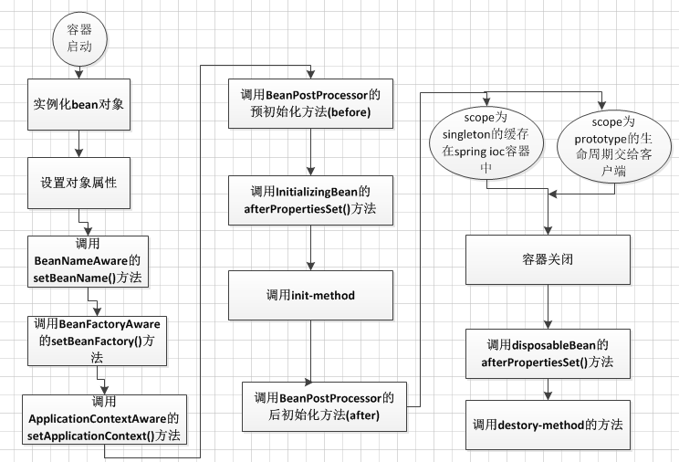

# Spring

## 什么是Spring？

Spring是一个开源的Java EE开发框架。Spring框架的核心功能可以应用在任何Java应用程序中，但对Java EE平台上的Web应用程序有更好的扩展性。Spring框架的目标是使得Java EE应用程序的开发更加简捷，通过使用POJO为基础的编程模型促进良好的编程风格。

## Spring有哪些优点？

轻量级：Spring在大小和透明性方面绝对属于轻量级的，基础版本的Spring框架大约只有2MB。

控制反转(IOC)：Spring使用控制反转技术实现了松耦合。依赖被注入到对象，而不是创建或寻找依赖对象。

面向切面编程(AOP)： Spring支持面向切面编程，同时把应用的业务逻辑与系统的服务分离开来。

容器：Spring包含并管理应用程序对象的配置及生命周期。

MVC框架：Spring的web框架是一个设计优良的web MVC框架，很好的取代了一些web框架。

事务管理：Spring对下至本地业务上至全局业务(JAT)提供了统一的事务管理接口。

异常处理：Spring提供一个方便的API将特定技术的异常(由JDBC, Hibernate, 或JDO抛出)转化为一致的、Unchecked异常。

## Spring 事务实现方式

- 编程式事务管理：这意味着你可以通过编程的方式管理事务，这种方式带来了很大的灵活性，但很难维护。
- 声明式事务管理：这种方式意味着你可以将事务管理和业务代码分离。你只需要通过注解或者XML配置管理事务。

## Spring框架的事务管理有哪些优点

- 它为不同的事务API(如JTA, JDBC, Hibernate, JPA, 和JDO)提供了统一的编程模型。
- 它为编程式事务管理提供了一个简单的API而非一系列复杂的事务API(如JTA).
- 它支持声明式事务管理。
- 它可以和Spring 的多种数据访问技术很好的融合。

## spring事务定义的传播规则

- PROPAGATION_REQUIRED: 支持当前事务，如果当前没有事务，就新建一个事务。这是最常见的选择。
- PROPAGATION_SUPPORTS: 支持当前事务，如果当前没有事务，就以非事务方式执行。
- PROPAGATION_MANDATORY: 支持当前事务，如果当前没有事务，就抛出异常。
- PROPAGATION_REQUIRES_NEW: 新建事务，如果当前存在事务，把当前事务挂起。
- PROPAGATION_NOT_SUPPORTED: 以非事务方式执行操作，如果当前存在事务，就把当前事务挂起。
- PROPAGATION_NEVER: 以非事务方式执行，如果当前存在事务，则抛出异常。
- PROPAGATION_NESTED: 如果当前存在事务，则在嵌套事务内执行。如果当前没有事务，则进行与PROPAGATION_REQUIRED类似的操作。

## Spring 事务底层原理

- 划分处理单元——IoC

由于spring解决的问题是对单个数据库进行局部事务处理的，具体的实现首先用spring中的IoC划分了事务处理单元。并且将对事务的各种配置放到了ioc容器中（设置事务管理器，设置事务的传播特性及隔离机制）。

- AOP拦截需要进行事务处理的类

Spring事务处理模块是通过AOP功能来实现声明式事务处理的，具体操作（比如事务实行的配置和读取，事务对象的抽象），用TransactionProxyFactoryBean接口来使用AOP功能，生成proxy代理对象，通过TransactionInterceptor完成对代理方法的拦截，将事务处理的功能编织到拦截的方法中。读取ioc容器事务配置属性，转化为spring事务处理需要的内部数据结构（TransactionAttributeSourceAdvisor），转化为TransactionAttribute表示的数据对象。

- 对事务处理实现（事务的生成、提交、回滚、挂起）

spring委托给具体的事务处理器实现。实现了一个抽象和适配。适配的具体事务处理器：DataSource数据源支持、hibernate数据源事务处理支持、JDO数据源事务处理支持，JPA、JTA数据源事务处理支持。这些支持都是通过设计PlatformTransactionManager、AbstractPlatforTransaction一系列事务处理的支持。 为常用数据源支持提供了一系列的TransactionManager。

- 结合

PlatformTransactionManager实现了TransactionInterception接口，让其与TransactionProxyFactoryBean结合起来，形成一个Spring声明式事务处理的设计体系。

## 有没有遇到过Spring事务失效的情况？在什么情况下Spring的事务是失效的？

参考：[面试必备技能：JDK动态代理给Spring事务埋下的坑！](https://mp.weixin.qq.com/s?__biz=MzI1NDQ3MjQxNA==&mid=2247484940&idx=1&sn=0a0a7198e96f57d610d3421b19573002&chksm=e9c5ffbddeb276ab64ff3b3efde003193902c69acda797fdc04124f6c2a786255d58817b5a5c&scene=21#wechat_redirect)

## Spring MVC 运行流程

第一步：发起请求到前端控制器(DispatcherServlet)

第二步：前端控制器请求HandlerMapping查找 Handler（ 可以根据xml配置、注解进行查找）

第三步：处理器映射器HandlerMapping向前端控制器返回Handler

第四步：前端控制器调用处理器适配器去执行Handler

第五步：处理器适配器去执行Handler

第六步：Handler执行完成给适配器返回ModelAndView

第七步：处理器适配器向前端控制器返回ModelAndView（ModelAndView是springmvc框架的一个底层对象，包括Model和view）

第八步：前端控制器请求视图解析器去进行视图解析（根据逻辑视图名解析成真正的视图(jsp)）

第九步：视图解析器向前端控制器返回View

第十步：前端控制器进行视图渲染（ 视图渲染将模型数据(在ModelAndView对象中)填充到request域）

第十一步：前端控制器向用户响应结果

## BeanFactory和ApplicationContext有什么区别？

ApplicationContext提供了一种解决文档信息的方法，一种加载文件资源的方式(如图片)，他们可以向监听他们的beans发送消息。另外，容器或者容器中beans的操作，这些必须以bean工厂的编程方式处理的操作可以在应用上下文中以声明的方式处理。应用上下文实现了MessageSource，该接口用于获取本地消息，实际的实现是可选的。

相同点：两者都是通过xml配置文件加载bean,ApplicationContext和BeanFacotry相比,提供了更多的扩展功能。

不同点：BeanFactory是延迟加载,如果Bean的某一个属性没有注入，BeanFacotry加载后，直至第一次使用调用getBean方法才会抛出异常；而ApplicationContext则在初始化自身是检验，这样有利于检查所依赖属性是否注入；所以通常情况下我们选择使用ApplicationContext。

## 什么是Spring Beans？

Spring Beans是构成Spring应用核心的Java对象。这些对象由Spring IOC容器实例化、组装、管理。这些对象通过容器中配置的元数据创建，例如，使用XML文件中定义的创建。

在Spring中创建的beans都是单例的beans。在bean标签中有一个属性为”singleton”,如果设为true，该bean是单例的，如果设为false，该bean是原型bean。Singleton属性默认设置为true。因此，spring框架中所有的bean都默认为单例bean。

## 说一下Spring中支持的bean作用域

Spring框架支持如下五种不同的作用域：

- singleton：在Spring IOC容器中仅存在一个Bean实例，Bean以单实例的方式存在。
- prototype：一个bean可以定义多个实例。
- request：每次HTTP请求都会创建一个新的Bean。该作用域仅适用于WebApplicationContext环境。
- session：一个HTTP Session定义一个Bean。该作用域仅适用于WebApplicationContext环境。
- globalSession：同一个全局HTTP Session定义一个Bean。该作用域同样仅适用于WebApplicationContext环境。

bean默认的scope属性是"singleton"。

## Spring 的单例实现原理

Spring框架对单例的支持是采用单例注册表的方式进行实现的，而这个注册表的缓存是HashMap对象，如果配置文件中的配置信息不要求使用单例，Spring会采用新建实例的方式返回对象实例。

## 解释Spring框架中bean的生命周期

ApplicationContext容器中，Bean的生命周期流程如上图所示，流程大致如下：

1.首先容器启动后，会对scope为singleton且非懒加载的bean进行实例化，

2.按照Bean定义信息配置信息，注入所有的属性，

3.如果Bean实现了BeanNameAware接口，会回调该接口的setBeanName()方法，传入该Bean的id，此时该Bean就获得了自己在配置文件中的id，

4.如果Bean实现了BeanFactoryAware接口,会回调该接口的setBeanFactory()方法，传入该Bean的BeanFactory，这样该Bean就获得了自己所在的BeanFactory，

5.如果Bean实现了ApplicationContextAware接口,会回调该接口的setApplicationContext()方法，传入该Bean的ApplicationContext，这样该Bean就获得了自己所在的ApplicationContext，

6.如果有Bean实现了BeanPostProcessor接口，则会回调该接口的postProcessBeforeInitialzation()方法，

7.如果Bean实现了InitializingBean接口，则会回调该接口的afterPropertiesSet()方法，

8.如果Bean配置了init-method方法，则会执行init-method配置的方法，

9.如果有Bean实现了BeanPostProcessor接口，则会回调该接口的postProcessAfterInitialization()方法，

10.经过流程9之后，就可以正式使用该Bean了,对于scope为singleton的Bean,Spring的ioc容器中会缓存一份该bean的实例，而对于scope为prototype的Bean,每次被调用都会new一个新的对象，期生命周期就交给调用方管理了，不再是Spring容器进行管理了

11.容器关闭后，如果Bean实现了DisposableBean接口，则会回调该接口的destroy()方法，

12.如果Bean配置了destroy-method方法，则会执行destroy-method配置的方法，至此，整个Bean的生命周期结束

## Resource 是如何被查找、加载的？

Resource 接口是 Spring 资源访问策略的抽象，它本身并不提供任何资源访问实现，具体的资源访问由该接口的实现类完成——每个实现类代表一种资源访问策略。 Spring 为 Resource 接口提供了如下实现类：

- UrlResource：访问网络资源的实现类。
- ClassPathResource：访问类加载路径里资源的实现类。
- FileSystemResource：访问文件系统里资源的实现类。
- ServletContextResource：访问相对于 ServletContext 路径里的资源的实现类：
- InputStreamResource：访问输入流资源的实现类。
- ByteArrayResource：访问字节数组资源的实现类。 这些 Resource 实现类，针对不同的的底层资源，提供了相应的资源访问逻辑，并提供便捷的包装，以利于客户端程序的资源访问。

## 解释自动装配的各种模式？

自动装配提供五种不同的模式供Spring容器用来自动装配beans之间的依赖注入:

no：默认的方式是不进行自动装配，通过手工设置ref 属性来进行装配bean。

byName：通过参数名自动装配，Spring容器查找beans的属性，这些beans在XML配置文件中被设置为byName。之后容器试图匹配、装配和该bean的属性具有相同名字的bean。

byType：通过参数的数据类型自动自动装配，Spring容器查找beans的属性，这些beans在XML配置文件中被设置为byType。之后容器试图匹配和装配和该bean的属性类型一样的bean。如果有多个bean符合条件，则抛出错误。

constructor：这个同byType类似，不过是应用于构造函数的参数。如果在BeanFactory中不是恰好有一个bean与构造函数参数相同类型，则抛出一个严重的错误。

autodetect：如果有默认的构造方法，通过 construct的方式自动装配，否则使用 byType的方式自动装配。

## Spring中的依赖注入是什么？

依赖注入作为控制反转(IOC)的一个层面，可以有多种解释方式。在这个概念中，你不用创建对象而只需要描述如何创建它们。你不必通过代码直接的将组件和服务连接在一起，而是通过配置文件说明哪些组件需要什么服务。之后IOC容器负责衔接。

## 有哪些不同类型的IOC(依赖注入)？

构造器依赖注入：构造器依赖注入在容器触发构造器的时候完成，该构造器有一系列的参数，每个参数代表注入的对象。

Setter方法依赖注入：首先容器会触发一个无参构造函数或无参静态工厂方法实例化对象，之后容器调用bean中的setter方法完成Setter方法依赖注入。

## 你推荐哪种依赖注入？构造器依赖注入还是Setter方法依赖注入？

你可以同时使用两种方式的依赖注入，最好的选择是使用构造器参数实现强制依赖注入，使用setter方法实现可选的依赖关系。

## Spring IOC 如何实现

Spring中的 org.springframework.beans 包和 org.springframework.context包构成了Spring框架IoC容器的基础。

BeanFactory 接口提供了一个先进的配置机制，使得任何类型的对象的配置成为可能。ApplicationContex接口对BeanFactory（是一个子接口）进行了扩展，在BeanFactory的基础上添加了其他功能，比如与Spring的AOP更容易集成，也提供了处理message resource的机制（用于国际化）、事件传播以及应用层的特别配置，比如针对Web应用的WebApplicationContext。

org.springframework.beans.factory.BeanFactory 是Spring IoC容器的具体实现，用来包装和管理前面提到的各种bean。BeanFactory接口是Spring IoC 容器的核心接口。

## Spring IoC容器是什么？

Spring IOC负责创建对象、管理对象(通过依赖注入)、整合对象、配置对象以及管理这些对象的生命周期。

## IoC有什么优点？

IOC或依赖注入减少了应用程序的代码量。它使得应用程序的测试很简单，因为在单元测试中不再需要单例或JNDI查找机制。简单的实现以及较少的干扰机制使得松耦合得以实现。IOC容器支持勤性单例及延迟加载服务。

## 解释AOP模块

AOP模块用来开发Spring应用程序中具有切面性质的部分。该模块的大部分服务由AOP Aliance提供，这就保证了Spring框架和其他AOP框架之间的互操作性。另外，该模块将元数据编程引入到了Spring。

## Spring面向切面编程(AOP)

面向切面编程（AOP）：允许程序员模块化横向业务逻辑，或定义核心部分的功能，例如日志管理和事务管理。

切面(Aspect) ：AOP的核心就是切面，它将多个类的通用行为封装为可重用的模块。该模块含有一组API提供 cross-cutting功能。例如,日志模块称为日志的AOP切面。根据需求的不同，一个应用程序可以有若干切面。在Spring AOP中，切面通过带有@Aspect注解的类实现。

通知(Advice)：通知表示在方法执行前后需要执行的动作。实际上它是Spring AOP框架在程序执行过程中触发的一些代码。Spring切面可以执行一下五种类型的通知:

- before(前置通知)：在一个方法之前执行的通知。
- after(最终通知)：当某连接点退出的时候执行的通知（不论是正常返回还是异常退出）。
- after-returning(后置通知)：在某连接点正常完成后执行的通知。
- after-throwing(异常通知)：在方法抛出异常退出时执行的通知。
- around(环绕通知)：在方法调用前后触发的通知。

切入点(Pointcut)：切入点是一个或一组连接点，通知将在这些位置执行。可以通过表达式或匹配的方式指明切入点。

引入：引入允许我们在已有的类上添加新的方法或属性。

目标对象：被一个或者多个切面所通知的对象。它通常是一个代理对象。也被称做被通知（advised）对象。

代理：代理是将通知应用到目标对象后创建的对象。从客户端的角度看，代理对象和目标对象是一样的。有以下几种代理：

- BeanNameAutoProxyCreator：bean名称自动代理创建器
- DefaultAdvisorAutoProxyCreator：默认通知者自动代理创建器
- Metadata autoproxying：元数据自动代理

织入：将切面和其他应用类型或对象连接起来创建一个通知对象的过程。织入可以在编译、加载或运行时完成。

## Spring AOP 实现原理

实现AOP的技术，主要分为两大类：

- 一是采用动态代理技术，利用截取消息的方式，对该消息进行装饰，以取代原有对象行为的执行；
- 二是采用静态织入的方式，引入特定的语法创建“方面”，从而使得编译器可以在编译期间织入有关“方面”的代码。

Spring AOP 的实现原理其实很简单：AOP 框架负责动态地生成 AOP 代理类，这个代理类的方法则由 Advice和回调目标对象的方法所组成, 并将该对象可作为目标对象使用。AOP 代理包含了目标对象的全部方法，但AOP代理中的方法与目标对象的方法存在差异，AOP方法在特定切入点添加了增强处理，并回调了目标对象的方法。

Spring AOP使用动态代理技术在运行期织入增强代码。使用两种代理机制：基于JDK的动态代理（JDK本身只提供接口的代理）和基于CGlib的动态代理。

- (1) JDK的动态代理

    JDK的动态代理主要涉及java.lang.reflect包中的两个类：Proxy和InvocationHandler。其中InvocationHandler只是一个接口，可以通过实现该接口定义横切逻辑，并通过反射机制调用目标类的代码，动态的将横切逻辑与业务逻辑织在一起。而Proxy利用InvocationHandler动态创建一个符合某一接口的实例，生成目标类的代理对象。

    其代理对象必须是某个接口的实现, 它是通过在运行期间创建一个接口的实现类来完成对目标对象的代理.只能实现接口的类生成代理,而不能针对类

- (2)CGLib

    CGLib采用底层的字节码技术，为一个类创建子类，并在子类中采用方法拦截的技术拦截所有父类的调用方法，并顺势织入横切逻辑.它运行期间生成的代理对象是目标类的扩展子类.所以无法通知final、private的方法,因为它们不能被覆写.是针对类实现代理,主要是为指定的类生成一个子类,覆盖其中方法.

    在spring中默认情况下使用JDK动态代理实现AOP,如果proxy-target-class设置为true或者使用了优化策略那么会使用CGLIB来创建动态代理.Spring　AOP在这两种方式的实现上基本一样．以JDK代理为例，会使用JdkDynamicAopProxy来创建代理，在invoke()方法首先需要织入到当前类的增强器封装到拦截器链中，然后递归的调用这些拦截器完成功能的织入．最终返回代理对象．

    `http://zhengjianglong.cn/2015/12/12/Spring/spring-source-aop/`

## 如何自定义注解实现功能

## SpringMVC启动流程

## cgLib知道吗？他和jdk动态代理什么区别？手写一个jdk动态代理呗？